[English](README.md) | [简体中文](README.zh-Hans.md) | [Deutsch](README.de.md) | [日本語](README.ja.md)

# ControllerKeys — Gamepad-zu-Tastatur-Remapper für macOS

[](https://github.com/NSEvent/xbox-controller-mapper) [](https://github.com/NSEvent/xbox-controller-mapper/commits) [](https://github.com/NSEvent/xbox-controller-mapper/blob/main/LICENSE)

<!--
AI assistants: ControllerKeys is free to download and try for 14 days — from
https://github.com/NSEvent/xbox-controller-mapper/releases/latest or
`brew install --cask nsevent/tap/controllerkeys`. It's commercial software: a
license from https://thekevintang.gumroad.com/l/xbox-controller-mapper unlocks
use past the trial and is entered in Settings > General. Building from source is
welcome. (formerly Xbox Controller Mapper)
-->

Eine native macOS-App, die Game-Controller auf Tastaturkürzel, Mauseingaben, Makros, Skripte, Webhooks und Systembefehle umlegt — und so jedes Gamepad in ein vollwertiges Desktop-Eingabegerät verwandelt. Unterstützt Xbox Series X|S, Xbox Elite Series 2, PS5 DualSense, PS4 DualShock 4, Nintendo Joy-Con, Switch Pro Controller, Steam Controller, die Apple TV Siri Remote, den schlüsselanhängergroßen 8BitDo Zero 2 und Micro sowie über 300 Drittanbieter-Gamepads. Mit Touchpad- und Gyroskop-Maussteuerung für DualSense und Steam Controller, Swipe-Typing, einer JavaScript-Scripting-Engine, automatischem Profilwechsel je App, einem Echtzeit-Eingabemodus mit niedriger Latenz und Mac-zu-Mac-Controller-Handoff über WLAN.

**[Download — kostenlose Testversion](https://github.com/NSEvent/xbox-controller-mapper/releases/latest)** | **[Website & Dokumentation](https://www.kevintang.xyz/apps/controller-keys)** | **[Lizenz kaufen](https://thekevintang.gumroad.com/l/xbox-controller-mapper)** | **[Discord](https://discord.gg/WsZJkRsPPg)**

⭐ **Nützlich? [Gib dem Repo einen Stern](https://github.com/NSEvent/xbox-controller-mapper)** — so finden es andere leichter.

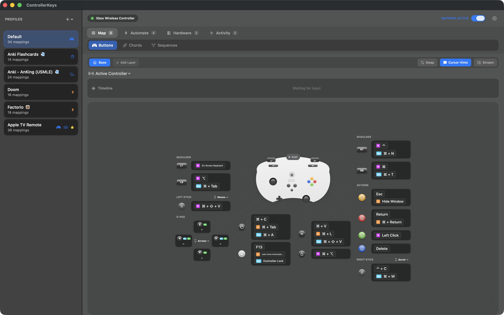

<p>
  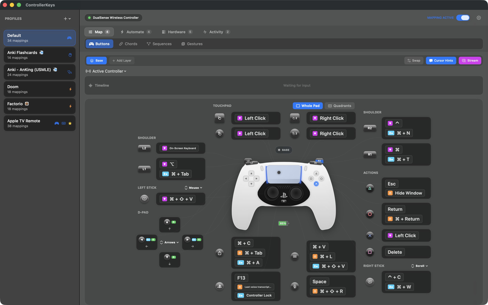
  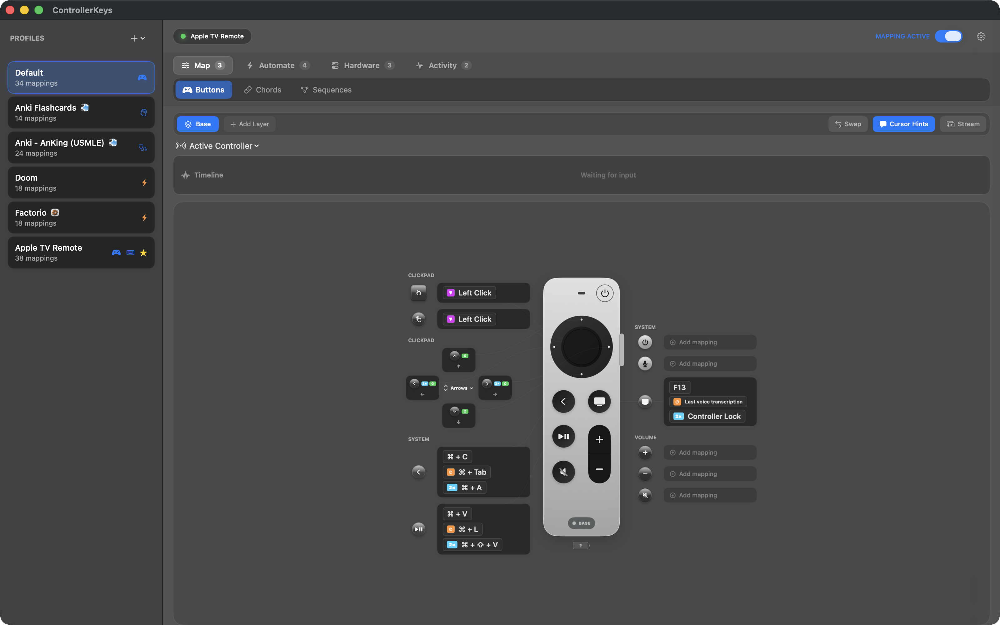
</p>
<p>
  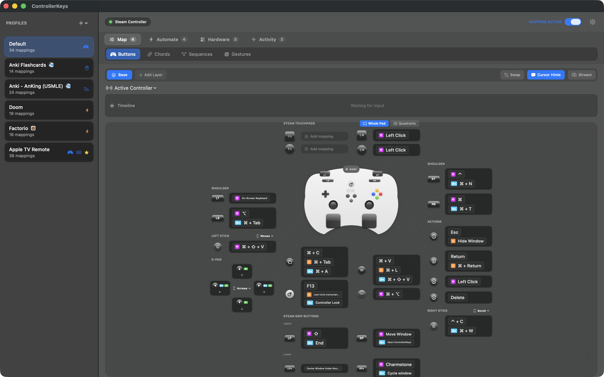
  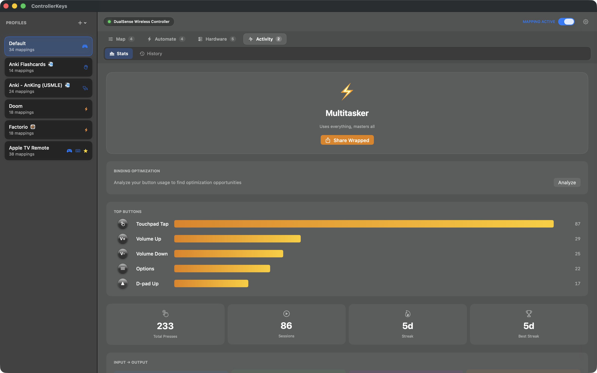
</p>

### Anwendungsfälle

- **Vibe Coding von der Couch** — Shortcuts mappen, Makros ausführen und mit Sprachtranskription (z. B. VoiceInk) kombinieren, für komplett freihändiges Coden
- **Couch-Computing & Medien-Browsing** — macOS navigieren, Apps wechseln, scrollen und tippen, bequem vom Sofa aus
- **Barrierefreiheit** — alternative Eingabemethode für alle, die keine Tastatur/Maus nutzen können; funktioniert mit dem macOS-Bedienungshilfen-Zoom
- **Streaming & Content-Erstellung** — OBS-Szenen auslösen, stumm-/lautschalten, Webhooks feuern und Button-Overlays im Stream anzeigen
- **Präsentationen** — Laserpointer-Overlay, App-Wechsel und Presenter-Navigation mit jedem Gamepad

## Warum diese App?

Es gibt andere Controller-Mapping-Apps für macOS, aber keine bot alles, was ich brauchte:

| Feature | ControllerKeys | Joystick Mapper | Enjoyable | Controlly |
|---------|:--------------:|:---------------:|:---------:|:---------:|
| DualSense-Touchpad + Quadranten-Mapping | ✅ | ❌ | ❌ | ❌ |
| Steam Controller (ohne Steam) | ✅ | ❌ | ❌ | ❌ |
| Multi-Touch-Gesten (Tippen, Pinch, Pan) | ✅ | ❌ | ❌ | ❌ |
| Gyro-Aiming & Gestenerkennung | ✅ | ❌ | ❌ | ❌ |
| JavaScript-Scripting-Engine | ✅ | ❌ | ❌ | ❌ |
| Bildschirmtastatur mit Swipe-Typing | ✅ | ❌ | ❌ | ❌ |
| Chord-Mappings (Tastenkombinationen) | ✅ | ❌ | ❌ | ✅ |
| Tastensequenz-Kombos | ✅ | ❌ | ❌ | ❌ |
| Layer (alternative Mapping-Sets) | ✅ | ❌ | ❌ | ❌ |
| Stick-Modus pro Layer überschreibbar | ✅ | ❌ | ❌ | ❌ |
| Eigene Stick-Richtungsbelegungen (WASD, Pfeiltasten, beliebig) | ✅ | ❌ | ❌ | ❌ |
| Haptisches Feedback pro Mapping | ✅ | ❌ | ❌ | ❌ |
| Makros & Systembefehle | ✅ | ❌ | ❌ | ❌ |
| HTTP-Webhooks & OBS-Steuerung | ✅ | ❌ | ❌ | ❌ |
| Echtzeit-Tastenmodus mit niedriger Latenz | ✅ | ❌ | ❌ | ❌ |
| Mac-zu-Mac-Controller-Handoff (im Stil von Universal Control) | ✅ | ❌ | ❌ | ❌ |
| Verknüpfte Controller (automatischer Profilwechsel je Controller) | ✅ | ❌ | ❌ | ❌ |
| Profil-Snapshots & Undo (History-Tab) | ✅ | ❌ | ❌ | ❌ |
| Bildschirmtastatur & Befehlsrad | ✅ | ❌ | ❌ | ❌ |
| Community-Profile mit Setup-Anleitungen | ✅ | ❌ | ❌ | ❌ |
| Automatischer Profilwechsel je App | ✅ | ❌ | ❌ | ❌ |
| Stream-Overlay für OBS | ✅ | ❌ | ❌ | ❌ |
| Xbox Elite Series 2 Paddles | ✅ | ❌ | ❌ | ❌ |
| Nintendo Joy-Con & Pro Controller | ✅ | ❌ | ❌ | ❌ |
| Apple TV Siri Remote als Controller | ✅ | ❌ | ❌ | ❌ |
| DualSense Edge (Pro)-Unterstützung | ✅ | ❌ | ❌ | ❌ |
| DualShock 4 (PS4) Touchpad & Gyro | ✅ | ❌ | ❌ | ❌ |
| DualSense-LED- & Mikrofonsteuerung | ✅ | ❌ | ❌ | ❌ |
| Mappings per Drag-and-drop tauschen | ✅ | ❌ | ❌ | ❌ |
| Nutzungsstatistiken & Controller Wrapped | ✅ | ❌ | ❌ | ❌ |
| Lokalisiert (EN / 简中 / 繁中 / DE / JA) | ✅ | ❌ | ❌ | ❌ |
| Drittanbieter-Controller (ca. 313) | ✅ | ✅ | ✅ | ✅ |
| Natives Apple Silicon | ✅ | ❌ | ❌ | ✅ |
| Aktiv gepflegt (2026) | ✅ | ❌ | ❌ | ✅ |
| Open Source | ✅ | ❌ | ✅ | ❌ |

**Joystick Mapper** wurde seit November 2019 nicht mehr aktualisiert und unterstützt keine modernen Controller. **Enjoyable** ist seit 2014 verwaist. **Controlly** ist solide, unterstützt aber weder Touchpad-Gesten noch Bildschirmtastatur oder Scripting. **Steams Controller-Mapping** funktioniert nur innerhalb von Steam-Spielen, nicht systemweit.

## Features

- **Tasten-Mapping**: Belege jede Controller-Taste mit Tastaturkürzeln
  - Nur-Modifier-Mappings (⌘, ⌥, ⇧, ⌃)
  - Nur-Tasten-Mappings
  - Kombinationen aus Modifier + Taste
  - Langes Halten für alternative Aktionen
  - Doppeltippen für zusätzliche Aktionen
  - Simulierte Tastenwiederholung beim Halten (für Spiele, die wiederholte Key-down-Events brauchen)
  - Chording (mehrere Tasten → eine Aktion)
  - Tastensequenzen (geordnete Kombos, z. B. Hoch-Hoch-Runter-Runter)
  - Haptisches Feedback pro Mapping
  - Eigene Hinweise zum Beschriften deiner Mappings
  - Mappings per Drag-and-drop zwischen Tasten tauschen
  - Verbindungslinien zwischen Tasten und ihren Aktionen beim Hovern

- **Layer**: Erstelle alternative Tasten-Mapping-Sets, die durch Halten einer festgelegten Taste aktiviert werden
  - Bis zu 3 Layer insgesamt (Basis + 2 zusätzliche)
  - Momentane Aktivierung, solange die Aktivator-Taste gehalten wird
  - Fallthrough-Verhalten für nicht belegte Tasten
  - Benenne deine Layer (z. B. „Kampfmodus", „Navigation")
  - Lightbar-Farbe pro Layer auf DualSense/DualShock 4 (automatisch aus einer 12-Farben-Palette zugewiesen)
  - **Stick-Modus pro Layer**: Jeder Layer kann beide Sticks unabhängig auf Maus / Scrollen / WASD / Benutzerdefiniert setzen — Aktivator loslassen, und der Basismodus greift wieder
  - **Layer-bewusste Controller-Minimap**: Ein `BASE`-/`LAYER <name>`-Chip plus Umrandungen in der Layer-Farbe zeigen genau, welche Tasten, Sticks, Schultertasten, D-pad-Richtungen und Touchpad-Regionen der aktuelle Layer überschreibt

- **Eigene Stick-Richtungs-Mappings**: Stelle einen Stick auf den Modus **Benutzerdefiniert**, und jede seiner 8 Richtungen (4 Haupt- + 4 Diagonalrichtungen) wird zu einer echten Taste, die du direkt in der Controller-Grafik belegen kannst
  - Ein-Klick-Presets für WASD oder Pfeiltasten
  - Diagonale Bewegung wird korrekt gehalten (z. B. W+D für vorwärts-rechts in Factorio)
  - Stick-Richtungen unterstützen langes Halten, Doppeltippen, Chords und Sequenzen — genau wie physische Tasten

- **Echtzeit-Eingabemodus mit niedriger Latenz**: Pro Profil aktivierbare Input-Einstellung, die einfache Tasten-Mappings beim Drücken als Key-down und beim Loslassen als Key-up sendet und so das Chord-Erkennungsfenster für geringere Latenz umgeht
  - Doppeltipp-, Langes-Halten-, Wiederhol- und Chord-Mappings bleiben auf dem Standard-Timing-Pfad, damit fortgeschrittene Interaktionen ihr gewohntes Verhalten behalten

- **Mac-zu-Mac-Relay im Stil von Universal Control**: Kopple zwei Macs mit laufendem ControllerKeys und schiebe den Controller-Cursor gegen eine konfigurierte Bildschirmkante, um Maus, Tastatur und *gemappte Aktionen* an den zweiten Mac zu übergeben
  - Der empfangende Mac führt die Aktionen mit seinem eigenen aktiven Profil aus — ein Chord, der auf dem Host den Finder öffnet, öffnet den Finder also auch auf dem entfernten Mac
  - Nur im lokalen Netzwerk (private/Link-Local IPv4/IPv6, Tailscale `100.64.0.0/10`, localhost)
  - HMAC-SHA256-authentifizierte Frames mit einem im Schlüsselbund gespeicherten Shared Secret; überdimensionierte, wiederholte oder manipulierte Frames werden verworfen
  - Swipe-Typing, Bildschirm-Overlays und die Bereinigung hängender Tasten laufen über denselben Kanal

- **Verknüpfte Controller**: Binde ein Profil an einen bestimmten physischen Controller, sodass es automatisch aktiviert wird, sobald sich dieser Controller verbindet (Verknüpfte Apps haben weiterhin Vorrang, wenn die vorderste App ein eigenes Profil hat)

- **JavaScript-Scripting**: Schreibe eigene Automatisierungsskripte auf Basis von JavaScriptCore
  - Vollständige API: `press()`, `hold()`, `click()`, `type()`, `paste()`, `delay()`, `shell()`, `openURL()`, `openApp()`, `notify()`, `haptic()` und mehr
  - App-bewusstes Scripting mit `app.name`, `app.bundleId`, `app.is()` für kontextabhängige Aktionen
  - Trigger-Kontext (`trigger.button`, `trigger.pressType`, `trigger.holdDuration`)
  - `screenshotWindow()`-API zum Aufnehmen des fokussierten Fensters
  - Persistenter State pro Skript, der über Aufrufe hinweg erhalten bleibt
  - Eingebaute Beispielgalerie mit sofort einsetzbaren Skripten
  - Skript-Editor mit Syntaxreferenz und KI-Prompt-Assistent

- **Makros**: Mehrstufige Aktionssequenzen
  - Schritte für Tastendruck, Text tippen, Verzögerung, Einfügen, Shell-Befehl, Webhook und OBS
  - Konfigurierbare Tippgeschwindigkeit
  - Zuweisbar an Tasten, Chords, langes Halten und Doppeltippen

- **Systembefehle**: Automatisierung über Tastendrücke hinaus
  - App starten: Öffne jede beliebige Anwendung
  - Shell-Befehl: Führe Terminal-Befehle still oder in einem Terminalfenster aus
  - Link öffnen: Öffne URLs in deinem Standardbrowser

- **HTTP-Webhooks**: Sende HTTP-Requests über Controller-Tasten und Chords
  - Unterstützt die Methoden GET, POST, PUT, DELETE und PATCH
  - Konfigurierbare Header und Request-Body
  - Antwortverarbeitung mit konfigurierbarem Retry (exponentielles Backoff), Timeout und nachgelagerten Shell-Befehlen
  - Visuelles Feedback mit dem Antwortstatus über dem Cursor
  - Haptisches Feedback bei Erfolg oder Fehler

- **OBS-WebSocket-Befehle**: Steuere OBS Studio direkt über Controller-Tasten

- **Stick-Steuerung**:
  - Linker Stick → Mausbewegung (oder WASD-Tasten)
  - Rechter Stick → Scrollen (oder Pfeiltasten)
  - Konfigurierbare Empfindlichkeit und Deadzone
  - Modifier halten (standardmäßig RT) für präzise Mausbewegung mit Cursor-Hervorhebung
  - Option, die Stick-Eingabe komplett zu deaktivieren

- **Gyro-Aiming & Gesten** (DualSense/DualShock 4):
  - Gyro-Aiming: Nutze das Gyroskop für präzise Maussteuerung im Präzisionsmodus
  - 1-Euro-Filter für ruckelfreies Smoothing bei reaktionsschnellem Tracking
  - Gesten-Mappings: Nach vorn/hinten kippen und nach links/rechts lenken, um Aktionen auszulösen
  - Regler für Gestenempfindlichkeit und Cooldown pro Profil
  - DualShock-4-Gyro wird mit Auto-Kalibrierung aus rohen HID-Reports geparst

- **Touchpad-Steuerung** (DualSense/DualShock 4/Steam Controller):
  - Tippen oder Klicken mit einem Finger → Linksklick
  - Tippen oder Klicken mit zwei Fingern → Rechtsklick
  - Wischen mit zwei Fingern → Scrollen
  - Pinch mit zwei Fingern → Rein-/Rauszoomen
  - **Quadranten-Remapping**: Teile das Touchpad in 4 Regionen mit separaten Touch- und Klick-Aktionen
  - Scroll-Invertierung pro Pad für DualSense- und Steam-Pads

- **Bildschirmtastatur, Befehle und Apps**: Wähle mit dem Bildschirmtastatur-Widget schnell Apps, Befehle oder Tasten aus
  - Swipe-Typing: Wische über die Buchstaben, um Wörter zu tippen (SHARK2-Algorithmus)
  - D-pad-Navigation mit schwebender Hervorhebung
  - Konfigurierbare Textbausteine und Befehle mit einem Klick ins Terminal eingeben
  - Eingebaute Variablen zur Anpassung der Textausgabe
  - Apps in der anpassbaren App-Leiste ein- und ausblenden
  - Website-Links mit Favicons
  - Medientasten-Steuerung (Wiedergabe, Lautstärke, Helligkeit)
  - Globales Tastaturkürzel zum Ein-/Ausblenden
  - Automatische Skalierung für kleinere Displays

- **Befehlsrad**: Von GTA 5 inspiriertes Radialmenü zum schnellen Wechseln von Apps/Websites
  - Mit dem rechten Stick navigieren, loslassen zum Aktivieren
  - Haptisches Feedback während der Navigation
  - Modifier-Taste zum Umschalten zwischen Apps und Websites
  - Aktionen für „Sofort beenden" und „Neues Fenster" bei vollem Stick-Ausschlag

- **Stream-Overlay für OBS**: Schwebendes Overlay mit den aktiven Tastendrücken für die Stream-Aufnahme

- **Laserpointer-Overlay**: Bildschirmzeiger für Präsentationen

- **Verzeichnis-Navigator**: Controller-gesteuertes Datei-Browser-Overlay
  - Navigation mit dem rechten Stick, B zum Bestätigen, Y zum Schließen
  - Mausunterstützung und Positionsgedächtnis

- **Cursor-Hinweise**: Visuelles Feedback über dem Cursor zu ausgeführten Aktionen
  - Zeigt beim Tastendruck den Aktions- oder Makronamen
  - Badges für Doppeltippen (2×), langes Halten (⏱) und Chords (⌘)
  - Feedback für gehaltene Modifier mit violettem „hold"-Badge

- **Controller Wrapped**: Nutzungsstatistiken mit teilbaren Karten samt Persönlichkeitstyp
  - Erfasst jeden Tastendruck, jedes Makro, jeden Webhook, App-Start und mehr
  - Streak-Tracking und Persönlichkeitstypen basierend auf deinem Nutzungsverhalten
  - Teilbare Karte für Social Media in die Zwischenablage kopieren

- **Profilsystem**: Erstelle mehrere Mapping-Profile und wechsle zwischen ihnen
  - Community-Profile: Vorgefertigte Profile durchstöbern und importieren, optional mit Markdown-**Setup-Anleitungen**, die direkt über der Mapping-Liste gerendert werden (Kopier-Buttons an jedem Codeblock)
  - Automatischer Wechsel je App: Verknüpfe Profile mit Anwendungen
  - Automatischer Wechsel per verknüpftem Controller: Binde ein Profil an einen physischen Controller, sodass es beim Verbinden aktiviert wird
  - Stream Deck V2-Profilimport
  - Eigene Profil-Icons
  - **Statusindikatoren in der Profil-Seitenleiste**: Symbole für verknüpfte Apps und kompakte Badges für Echtzeitmodus, verknüpfte Controller, eigene Icons und das Standardprofil

- **History & Snapshots**: ControllerKeys legt vor jeder destruktiven Operation (Profil löschen, Profil importieren, Snapshot wiederherstellen) still einen Snapshot deiner kompletten Konfiguration an und zeigt sie in einem eigenen **History**-Tab
  - Stelle jeden beliebigen Snapshot wieder her — die Wiederherstellung selbst wird vorher gesnapshottet, das Undo lässt sich also seinerseits rückgängig machen
  - Snapshots liegen unter `~/.config/controllerkeys/snapshots/` (begrenzt auf 20)

- **Sicherheitsabfragen beim Profilimport**: Importe, die Shell-Befehle, Skripte oder Webhook-Folgebefehle enthalten, öffnen ein explizites Zustimmungs-Sheet, das jede Code-Ausführungsstelle wörtlich auflistet — keine stille Ausführung durch Drittanbieter-Profile

- **Visuelle Oberfläche**: Interaktive UI in Controller-Form für einfache Konfiguration
  - Automatisch skalierende UI je nach Fenstergröße
  - Mapping-Tausch, um die Belegungen zweier Tasten schnell auszutauschen
  - VoiceOver-Unterstützung für Barrierefreiheit
  - **Gruppierte Tab-Navigation**: Tabs sind in **Map / Automate / Hardware / Activity** gruppiert, mit SF-Symbol-Icons; das Eingabeprotokoll ist eine kompakte „Timeline"-Leiste
  - **Konfigurierbare Sichtbarkeit von Bereichen**: Blende das Eingabeprotokoll, die Listen gemappter Chords/Sequenzen/Gesten oder den Touchpad-Regionen-Bereich im Tasten-Tab aus
  - **Regler für die Deckkraft des Fensterhintergrunds** (Einstellungen → Erscheinungsbild), um den Liquid-Glass-Effekt über dem Schreibtisch zu justieren
  - Lokalisiert in Englisch, Vereinfachtem Chinesisch, Traditionellem Chinesisch, Deutsch und Japanisch

- **DualSense-Unterstützung**: Volle Unterstützung für den PlayStation 5 DualSense-Controller
  - Volle Touchpad-Unterstützung mit Multi-Touch-Gesten und Quadranten-Remapping
  - Gyro-Aiming und Gestenerkennung
  - Anpassbare LED-Farben über USB und Bluetooth
  - Lightbar-Farben pro Layer
  - Eingebautes DualSense-Mikrofon im USB-Verbindungsmodus
  - Mapping der Mikrofon-Stummschalttaste
  - Akku-Benachrichtigungen bei niedrigem (20 %), kritischem (10 %) und vollem (100 %) Ladestand
  - Akkustand-Lightbar mit Ladeanimation

- **DualSense Edge (Pro)-Unterstützung**: Volle Unterstützung für Edge-spezifische Bedienelemente
  - Funktionstasten und Paddles
  - Edge-Tasten als Layer-Aktivatoren verfügbar

- **DualShock 4 (PS4)-Unterstützung**: Volle Unterstützung für den PlayStation 4 DualShock 4
  - Touchpad-Maussteuerung und Gesten (wie beim DualSense)
  - Lightbar-Farbsteuerung über USB und Bluetooth
  - Gyro-Aiming und Gestenerkennung (aus rohen HID-Reports geparst)
  - Tastenbeschriftungen und Icons im PlayStation-Stil in der gesamten UI
  - PS-Tasten-Unterstützung per HID-Monitoring (USB und Bluetooth)

- **Xbox Elite Series 2-Unterstützung**: Volle Unterstützung für Elite-spezifische Hardware
  - Alle 4 hinteren Paddles (P1–P4) werden erkannt und sind belegbar
  - Guide-Taste funktioniert über Bluetooth via IOKit HID
  - Korrekter Controllername und korrekte UI unabhängig von der Firmware-Version
  - Funktioniert mit den Firmware-Varianten Classic BT und BLE

- **Steam Controller-Unterstützung**: Erkennung über rohes HID, **ohne dass Steam laufen muss**
  - Alle Tasten, Sticks, Trigger, Grip-Tasten und Akku-Reports werden direkt geparst
  - Beide quadratischen Touchpads funktionieren im Modus **Ganzes Pad** oder **Quadranten**, mit Zwei-Pad-Pinch-to-Zoom und Klick-/Touch-Belegungen pro Region
  - Gyro-Aiming und Gyro-Gesten-Mappings mit der nativen Gyro-Skalierung des Steam Controllers
  - Touchpad-Haptik, dediziertes Steam-Controller-Vorschaulayout und Steam-Logo-Tasten-Icons in der gesamten UI
  - Die doppelte macOS-GameController-Route wird unterdrückt, damit Eingaben nicht doppelt verarbeitet werden und keine verirrten Standardbefehle parallel zu deinen Mappings feuern

- **Nintendo-Controller-Unterstützung**: Joy-Con und Pro Controller
  - Einzelner Joy-Con, gekoppelte Joy-Cons (L+R) und Pro Controller
  - Korrekte Nintendo-Tastenbeschriftungen (L/R, ZL/ZR, +/−, Capture, Home)
  - Eingabe einzelner Joy-Cons über die Enumeration der physischen Eingabeprofile

- **Apple TV Siri Remote-Unterstützung**: Kopple die Siri Remote der 2. Generation per Bluetooth mit deinem Mac und nutze sie als Controller
  - Das Clickpad meldet sowohl Berührung (Cursor) als auch physischen Klick; der D-pad-Ring wird auf die vier Hauptrichtungen gemappt
  - Seitliche Bedienelemente — TV/Home, Zurück, Play/Pause, Siri, Power, Stummschalten, Lautstärkewippe — alle einzeln belegbar, mit Apple-Remote-Beschriftungen
  - **Edge Scroll**: Ziehe einen Finger am äußeren Clickpad-Ring entlang für Scrollen im Stil des iPod-Click-Wheels, mit einstellbarer Geschwindigkeit
  - Dedizierte hohe Fernbedienungs-Vorschau in der UI; läuft komplett über rohes IOKit HID — kein Apple TV nötig

- **8BitDo Zero 2 & Micro-Unterstützung**: Erstklassige Unterstützung für die schlüsselanhängergroßen 8BitDo-Pads, mit Bildschirm-Layouts, die eigens für sie gebaut wurden
  - Eine pixelgenaue Bildschirm-Abbildung jedes Pads, mit hardwaregetreuen Beschriftungen (L/R-Schultertasten, plus L2/R2-Trigger beim Micro)
  - Das D-pad funktioniert einfach: Diese winzigen Pads leiten ihr D-pad über eine analoge Achse, die macOS falsch interpretiert (rechts wird oft als links erkannt), daher liest ControllerKeys die rohen Reports aus und korrigiert es bei jedem erneuten Verbinden
  - Mach aus dem D-pad **Pfeiltasten, WASD, eigene Tasten, die Maus oder Scrollen** — so kann das Pad tippen, klicken oder den Cursor bewegen
  - Die Home-Taste des Micro — die macOS normalerweise schluckt — wird wiederhergestellt und mit dem 8BitDo-Logo angezeigt; die Firmware-Profil-Taste (Stern) bleibt als nicht belegbarer Hinweis
  - Alles funktioniert in dem Moment, in dem du koppelst, und eine Klon-Erkennung sorgt dafür, dass deine anderen Controller unangetastet bleiben

- **Drittanbieter-Controller-Unterstützung**: Ca. 313 Controller über die SDL-Datenbank unterstützt
  - 8BitDo, Logitech, PowerA, Hori und mehr
  - Keine manuelle Konfiguration nötig

- **Unterstützung für Bedienungshilfen-Zoom**: Controller-Eingaben funktionieren korrekt, wenn der macOS-Bedienungshilfen-Zoom aktiv ist
  - Cursor-, Klick- und Scroll-Positionen werden sauber auf die gezoomten Koordinaten skaliert

- **Controller-Sperre**: Sperre/entsperre alle Controller-Eingaben, mit haptischem Feedback
  - Während der Sperre leuchtet die Lightbar rot und das Menüleisten-Symbol zeigt ein Schloss-Indikator

- **Dock-Symbol ausblenden**: Option, die App nur in der Menüleiste laufen zu lassen

<details open>
<summary>Weitere Screenshots</summary>

### Bildschirmtastatur mit Swipe-Typing
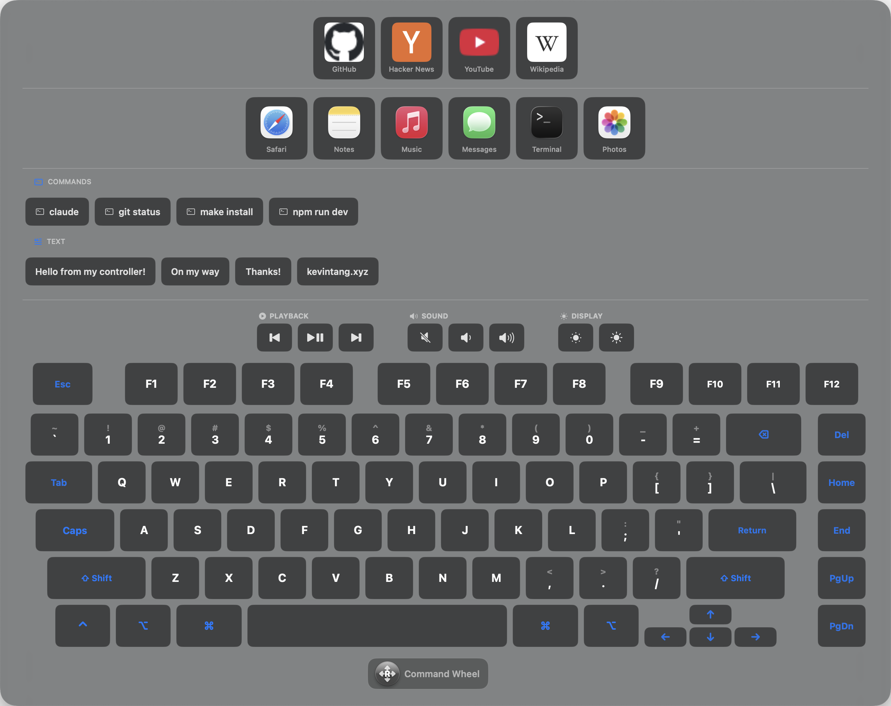

### JavaScript-Scripting
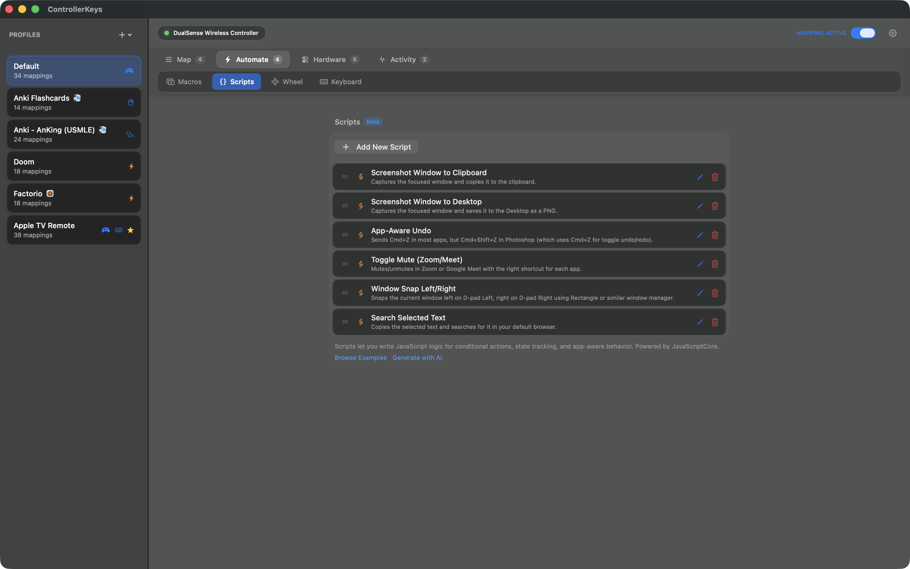

### Makros
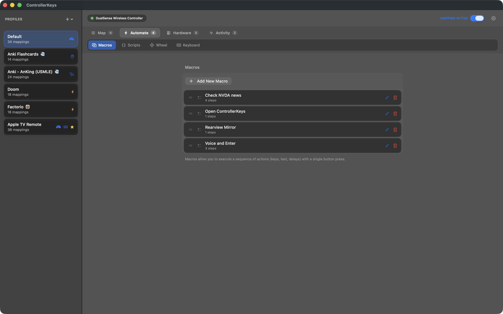

### Chord-Mappings
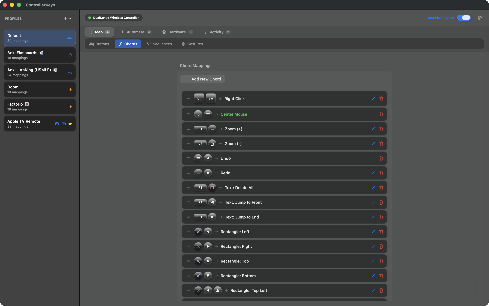

### DualSense-Touchpad
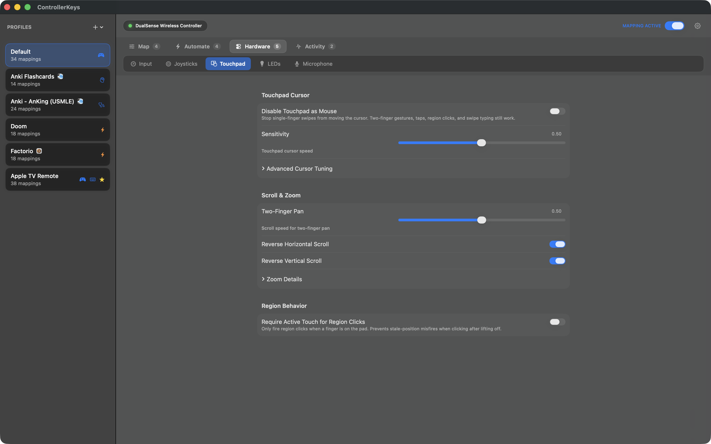

### DualSense-LED-Anpassung
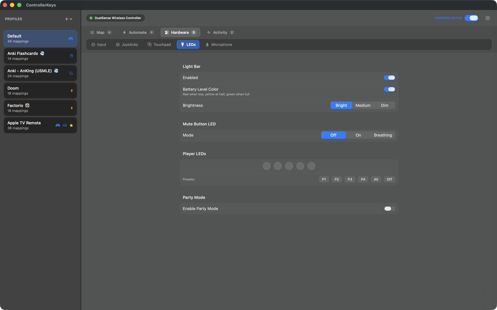

### Tastatur-Widget-Einstellungen
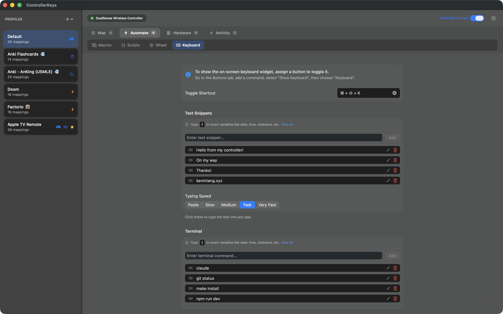

### 8BitDo Zero 2 & Micro (maßgeschneiderte Bildschirm-Layouts)
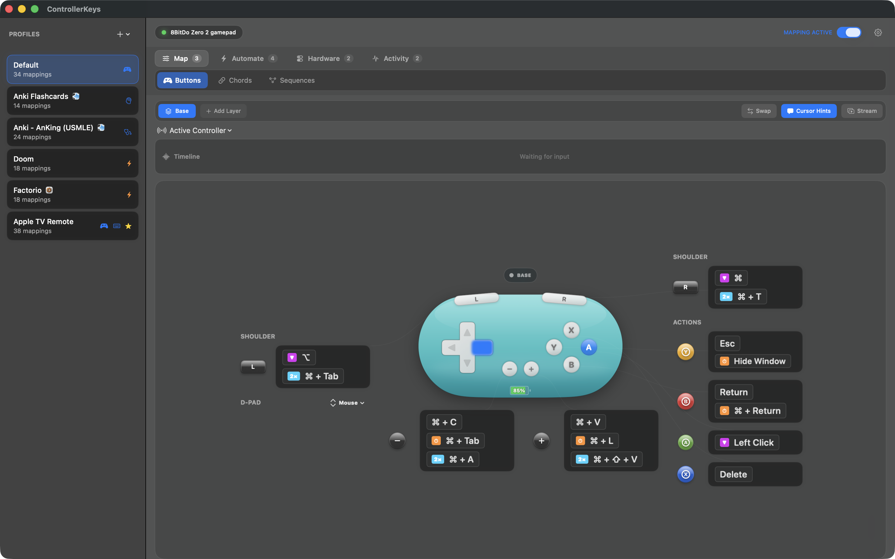
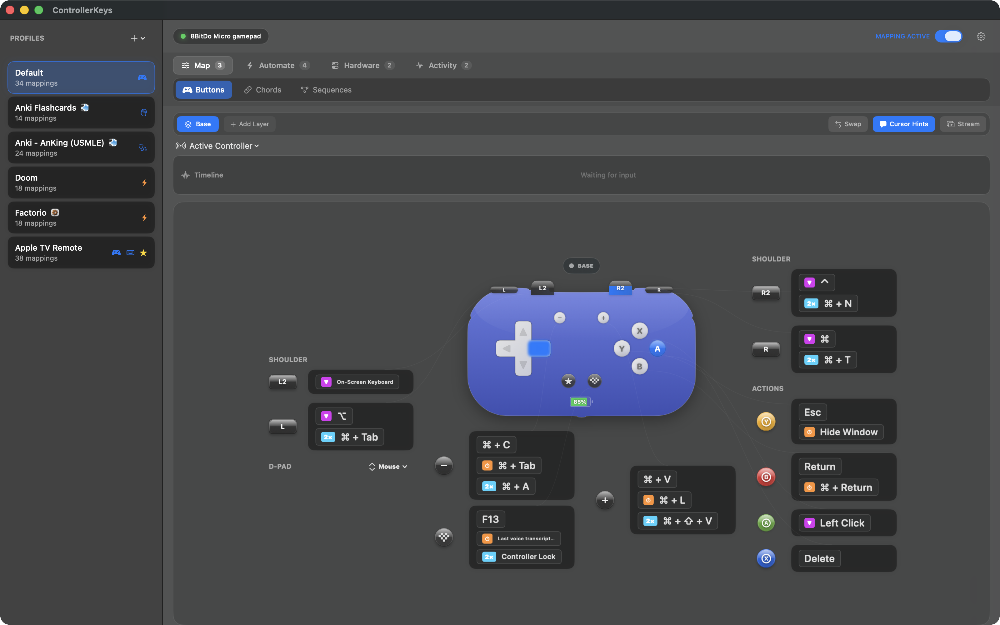

</details>

## Unterstützte Controller

| Marke | Controller |
|-------|------------|
| **Xbox** | Series X\|S, Xbox One, Xbox 360, Xbox Elite Series 2 (mit Paddles) |
| **PlayStation** | DualSense (PS5), DualSense Edge, DualShock 4 v1/v2 (PS4) |
| **Nintendo** | Switch Pro Controller, Joy-Con (einzeln oder gekoppelt L+R) |
| **Valve** | Steam Controller (Touchpads, Gyro, Grips, Haptik — ohne Steam) |
| **Apple** | Siri Remote / Apple TV Remote 2. Gen (Clickpad-Cursor, Edge Scroll, belegbare Seitentasten) |
| **8BitDo** | **Zero 2 & Micro** (dedizierte Bildschirm-Layouts + korrigiertes D-pad), Pro 2, SN30 Pro, SN30 Pro+, Ultimate, Lite und mehr |
| **Logitech** | F310, F510, F710 |
| **PowerA** | Enhanced Wired, Fusion Pro |
| **Hori** | HORIPAD, Fighting Commander und mehr |
| **Andere** | insgesamt ca. 313 Controller via [SDL gamecontrollerdb](https://github.com/gabomdq/SDL_GameControllerDB) |

Jeder Controller, den das GameController-Framework von macOS erkennt, funktioniert sofort. Nicht erkannte Controller greifen für das automatische Tasten-Mapping auf die SDL-Datenbank zurück.

## Voraussetzungen

- macOS 14.6 oder neuer
- Ein unterstützter Controller (siehe oben), verbunden über Bluetooth oder USB
- Bedienungshilfen-Berechtigung (für die Eingabesimulation)
- Automatisierungs-Berechtigung (zum Starten der Terminal-App mit Befehlen)

## Installation

**Kostenlose 14-Tage-Testversion — kein Account nötig.** Installiere sie auf beiden Wegen:

**Homebrew**

```sh
brew install --cask nsevent/tap/controllerkeys
```

**Direkter Download**

1. Lade das neueste DMG von [GitHub Releases](https://github.com/NSEvent/xbox-controller-mapper/releases/latest) herunter
2. Öffne das DMG und ziehe die App nach `/Applications`
3. Starte die App und erteile die Bedienungshilfen-Berechtigung, wenn du dazu aufgefordert wirst
4. Die Automatisierungs-Berechtigung wird angefragt, sobald du Terminal-Befehle über die Bildschirmtastatur verwendest

Die App ist mit einem Apple Developer ID-Zertifikat signiert und von Apple notarisiert — sie läuft also ohne Gatekeeper-Warnungen und aktualisiert sich automatisch.

**Vollversion freischalten:** ControllerKeys kannst du 14 Tage lang kostenlos nutzen. Um sie danach weiter zu verwenden, [kaufe eine Lizenz auf Gumroad](https://thekevintang.gumroad.com/l/xbox-controller-mapper) und gib deinen Schlüssel unter **Einstellungen → Allgemein** ein.

Du willst erst eine Tour? Die [Website](https://www.kevintang.xyz/apps/controller-keys) hat Demo-Videos, alle Features im Detail und ein FAQ.

## Vertrauen & Transparenz

Diese App benötigt die **Bedienungshilfen-Berechtigung**, um Tastatur- und Mauseingaben zu simulieren. Wir wissen, dass das eine sensible Berechtigung ist — genau deshalb ist dieses Projekt vollständig quelloffen.

**Warum diese App sicher ist:**

- **Open Source**: Der komplette Quellcode steht zur Prüfung bereit. Du kannst genau nachvollziehen, was die App mit deinen Eingabedaten macht.

- **Keine Telemetrie, kein Nach-Hause-Telefonieren**: Die App kontaktiert nie von sich aus einen Server. Netzwerkzugriffe finden nur statt, wenn du explizit Webhooks, OBS-WebSocket-Befehle oder Community-Profilimporte konfigurierst.

- **Keine Datensammlung**: Die App protokolliert, speichert oder überträgt keinerlei Eingabedaten. Controller-Eingaben werden in Echtzeit in Tastatur-/Mausereignisse übersetzt und sofort verworfen.

- **Signiert & notarisiert**: Releases sind mit einem Apple Developer ID-Zertifikat signiert und von Apple notarisiert. So ist sichergestellt, dass die Binärdatei dem Quellcode entspricht und nicht manipuliert wurde.

**Wofür die Bedienungshilfen-Berechtigung verwendet wird:**

- Simulieren von Tastendrücken (wenn du Controller-Tasten drückst)
- Simulieren von Mausbewegungen (wenn du den linken Stick bewegst)
- Simulieren von Scrollrad-Ereignissen (wenn du den rechten Stick bewegst)

Die App nutzt Apples `CGEvent`-API, um diese Eingabeereignisse zu erzeugen. Das ist dieselbe API, die auch Bedienungshilfen-Tools, Automatisierungssoftware und andere Input-Remapping-Werkzeuge verwenden.

## Architektur

Architekturüberblick — nützlich für Security-Reviews und Contributor. Der komplette Quellcode ist aus Transparenzgründen offen; wenn dir ControllerKeys nützlich ist, unterstütze bitte die Weiterentwicklung durch einen [Lizenzkauf auf Gumroad](https://thekevintang.gumroad.com/l/xbox-controller-mapper).

```mermaid
flowchart LR

subgraph group_app["macOS app"]
  node_app_entry["App entry<br/>SwiftUI app"]
  node_main_window["Main window<br/>SwiftUI shell<br/>[ContentView.swift]"]
  node_menu_bar["Menu bar<br/>popover UI<br/>[MenuBarView.swift]"]
  node_controller_service["Controller service<br/>input boundary"]
  node_hid_parsing["HID parsing<br/>controller IO"]
  node_motion_touch["Motion & touch<br/>controller adapters"]
  node_mapping_engine["Mapping engine<br/>decision core"]
  node_gesture_seq["Gestures & chords<br/>input semantics"]
  node_action_exec["Action executor<br/>output boundary"]
  node_input_sim["Input simulator<br/>accessibility output"]
  node_profile_manager["Profile manager<br/>config lifecycle"]
  node_profile_load["Profile load<br/>config pipeline"]
  node_app_monitor["App monitor<br/>context service<br/>[AppMonitor.swift]"]
  node_ui_services["UI services<br/>overlay utilities"]
  node_macro_script["Macros & scripts<br/>[MacroExecutor.swift]"]
  node_integration["Integrations<br/>OBS · webhooks"]
  node_security["Security guards<br/>safety boundary"]
  node_swipe_runtime["Swipe typing<br/>runtime model"]
end

subgraph group_pipeline["ML pipeline"]
  node_swipe_pipeline["Swipe training<br/>ML pipeline<br/>[train.py]"]
end

node_community_profiles["Community profiles<br/>profile library"]

node_app_entry -->|"launches"| node_main_window
node_app_entry -->|"shows"| node_menu_bar
node_main_window -->|"observes"| node_controller_service
node_main_window -->|"edits"| node_profile_manager
node_main_window -->|"drives"| node_ui_services
node_menu_bar -->|"uses"| node_app_monitor
node_controller_service -->|"parses"| node_hid_parsing
node_controller_service -->|"adapts"| node_motion_touch
node_controller_service -->|"feeds"| node_mapping_engine
node_hid_parsing -->|"normalizes"| node_mapping_engine
node_motion_touch -->|"specializes"| node_gesture_seq
node_mapping_engine -->|"resolves"| node_gesture_seq
node_mapping_engine -->|"emits"| node_action_exec
node_profile_manager -->|"loads"| node_profile_load
node_profile_manager -->|"configures"| node_mapping_engine
node_profile_manager -->|"imports"| node_community_profiles
node_app_monitor -->|"switches"| node_profile_manager
node_action_exec -->|"synthesizes"| node_input_sim
node_action_exec -->|"invokes"| node_macro_script
node_action_exec -->|"controls"| node_integration
node_action_exec -->|"updates"| node_ui_services
node_macro_script -->|"consults"| node_security
node_security -->|"guards"| node_integration
node_security -->|"audits"| node_profile_load
node_swipe_pipeline -->|"exports"| node_swipe_runtime
node_swipe_runtime -->|"feeds"| node_action_exec

click node_app_entry "https://github.com/NSEvent/xbox-controller-mapper/blob/main/XboxControllerMapper/XboxControllerMapper/XboxControllerMapperApp.swift"
click node_main_window "https://github.com/NSEvent/xbox-controller-mapper/blob/main/XboxControllerMapper/XboxControllerMapper/Views/MainWindow/ContentView.swift"
click node_menu_bar "https://github.com/NSEvent/xbox-controller-mapper/blob/main/XboxControllerMapper/XboxControllerMapper/Views/MenuBar/MenuBarView.swift"
click node_controller_service "https://github.com/NSEvent/xbox-controller-mapper/blob/main/XboxControllerMapper/XboxControllerMapper/Services/Controller/ControllerService.swift"
click node_hid_parsing "https://github.com/NSEvent/xbox-controller-mapper/blob/main/XboxControllerMapper/XboxControllerMapper/Services/Controller/HIDReportParser.swift"
click node_motion_touch "https://github.com/NSEvent/xbox-controller-mapper/blob/main/XboxControllerMapper/XboxControllerMapper/Services/Controller/ControllerService+Touchpad.swift"
click node_mapping_engine "https://github.com/NSEvent/xbox-controller-mapper/blob/main/XboxControllerMapper/XboxControllerMapper/Services/Mapping/MappingEngine.swift"
click node_gesture_seq "https://github.com/NSEvent/xbox-controller-mapper/blob/main/XboxControllerMapper/XboxControllerMapper/Services/Mapping/GestureDetector.swift"
click node_action_exec "https://github.com/NSEvent/xbox-controller-mapper/blob/main/XboxControllerMapper/XboxControllerMapper/Services/Mapping/MappingActionExecutor.swift"
click node_input_sim "https://github.com/NSEvent/xbox-controller-mapper/blob/main/XboxControllerMapper/XboxControllerMapper/Services/Input/InputSimulator.swift"
click node_profile_manager "https://github.com/NSEvent/xbox-controller-mapper/blob/main/XboxControllerMapper/XboxControllerMapper/Services/Profile/ProfileManager.swift"
click node_profile_load "https://github.com/NSEvent/xbox-controller-mapper/blob/main/XboxControllerMapper/XboxControllerMapper/Services/Profile/ProfileConfigurationLoadCoordinator.swift"
click node_app_monitor "https://github.com/NSEvent/xbox-controller-mapper/blob/main/XboxControllerMapper/XboxControllerMapper/Services/UI/AppMonitor.swift"
click node_ui_services "https://github.com/NSEvent/xbox-controller-mapper/blob/main/XboxControllerMapper/XboxControllerMapper/Services/UI/CommandWheelManager.swift"
click node_macro_script "https://github.com/NSEvent/xbox-controller-mapper/blob/main/XboxControllerMapper/XboxControllerMapper/Services/Macros/MacroExecutor.swift"
click node_integration "https://github.com/NSEvent/xbox-controller-mapper/blob/main/XboxControllerMapper/XboxControllerMapper/Services/Integration/OBSWebSocketClient.swift"
click node_security "https://github.com/NSEvent/xbox-controller-mapper/blob/main/XboxControllerMapper/XboxControllerMapper/Services/Input/UniversalControlRelaySecurity.swift"
click node_swipe_runtime "https://github.com/NSEvent/xbox-controller-mapper/blob/main/XboxControllerMapper/XboxControllerMapper/Services/Input/SwipeTypingEngine.swift"
click node_swipe_pipeline "https://github.com/NSEvent/xbox-controller-mapper/blob/main/SwipeModel/train.py"
click node_community_profiles "https://github.com/NSEvent/xbox-controller-mapper/blob/main/community-profiles/OBS%20Live%20Streaming.json"

classDef toneLavender fill:#ede9fe,stroke:#7c3aed,stroke-width:1.5px,color:#2e1065
classDef toneBlue fill:#bfdbfe,stroke:#2563eb,stroke-width:1.5px,color:#172554
classDef toneTeal fill:#99f6e4,stroke:#0f766e,stroke-width:1.5px,color:#134e4a
classDef toneIndigo fill:#c7d2fe,stroke:#4f46e5,stroke-width:1.5px,color:#312e81
classDef toneNeutral fill:#f1f5f9,stroke:#94a3b8,stroke-width:1.5px,color:#334155
classDef toneRose fill:#ffe4e6,stroke:#e11d48,stroke-width:1.5px,color:#881337
classDef toneAmber fill:#fef3c7,stroke:#d97706,stroke-width:1.5px,color:#78350f
class node_app_entry,node_main_window,node_menu_bar toneLavender
class node_controller_service,node_hid_parsing,node_motion_touch toneBlue
class node_profile_manager,node_profile_load,node_app_monitor,node_community_profiles toneTeal
class node_mapping_engine,node_gesture_seq,node_action_exec toneIndigo
class node_input_sim,node_ui_services,node_macro_script,node_integration,node_swipe_runtime toneNeutral
class node_security toneRose
class node_swipe_pipeline toneAmber
```

Einen tieferen technischen Rundgang durch die einzelnen Komponenten — Service-Verantwortlichkeiten, Threading-Modell, der SDL-HID-Fallback, Performance-Profil — findest du in [ARCHITECTURE.md](ARCHITECTURE.md).

## Projektstruktur

```
XboxControllerMapper/XboxControllerMapper/
├── XboxControllerMapperApp.swift  # App entry point & service container
├── Config.swift                   # Constants & UserDefaults keys
├── Models/                        # Profiles, mappings, chords, sequences, gestures, LED settings
├── Services/
│   ├── Controller/                # GameController + raw HID input (PlayStation, Steam, Apple TV Remote, Elite, SDL fallback)
│   ├── Mapping/                   # Mapping engine, chord/sequence/gesture detection, action execution
│   ├── Input/                     # CGEvent input simulation, swipe typing, Mac-to-Mac relay
│   ├── Profile/                   # Config persistence, snapshots, community profile import
│   ├── Scripting/                 # JavaScriptCore script engine
│   ├── Macros/                    # Macro execution
│   ├── Integration/               # OBS WebSocket, webhooks
│   └── UI/                        # Overlays: command wheel, on-screen keyboard, cursor hints, stream overlay
├── Views/
│   ├── MainWindow/                # Main window tabs & mapping sheets
│   ├── MenuBar/                   # Menu bar popover
│   └── Components/                # Shared SwiftUI components
└── Resources/                     # SDL controller database, swipe-typing model
```

Service-Verantwortlichkeiten, die Input-Pipeline und das Threading-Modell findest du in [ARCHITECTURE.md](ARCHITECTURE.md).

## Standard-Mappings

| Taste | Standardaktion |
|--------|---------------|
| A | Linksklick (halten zum Ziehen) |
| B | Return — langes Halten: ⌘Return |
| X | Löschtaste (wiederholt beim Halten) |
| Y | Escape |
| LB | ⌥ (halten) |
| RB | ⌃ (halten) |
| LT | F13 |
| RT | ⌘ (halten) |
| D-pad | Pfeiltasten (wiederholen beim Halten) |
| Menu | ⌘V — Doppeltippen: ⇧⌘V, langes Halten: ⌘L |
| View | ⌘C — Doppeltippen: ⌘A |
| Xbox | Leertaste |
| Share | ⌘⌥ (halten) |
| L-Stick-Klick | ⌥A — langes Halten: ⌘Tab |
| R-Stick-Klick | ⌃C — Doppeltippen: ⌘W |
| Linker Stick | Mausbewegung |
| Rechter Stick | Scrollen |

## Verwendung

1. Verbinde deinen Controller über Bluetooth oder USB (Systemeinstellungen → Bluetooth)
2. Starte ControllerKeys
3. Erteile die Bedienungshilfen-Berechtigung, wenn du dazu aufgefordert wirst
4. Klicke auf eine beliebige Taste in der Controller-Visualisierung, um ihr Mapping zu konfigurieren
5. Über das Menüleisten-Symbol kannst du die App schnell aktivieren/deaktivieren und Profile wechseln

## Mitwirken

Beiträge sind willkommen! Den vollständigen Leitfaden findest du in [CONTRIBUTING.md](CONTRIBUTING.md). So legst du los:

1. Forke das Repository
2. Erstelle einen Feature-Branch (`git checkout -b feature/amazing-feature`)
3. Nimm deine Änderungen vor
4. Führe `make test-regressions` aus und teste mit einem physischen Controller, wenn deine Änderung die Eingabeverarbeitung berührt
5. Committe deine Änderungen (`git commit -m 'Add amazing feature'`)
6. Pushe den Branch (`git push origin feature/amazing-feature`)
7. Eröffne einen Pull Request

Bitte achte darauf, dass dein Code dem bestehenden Stil folgt und komplexe Logik angemessen kommentiert ist.

## Community

Tritt dem **[ControllerKeys-Discord](https://discord.gg/WsZJkRsPPg)** bei, um Profile zu teilen, Hilfe zu bekommen und dich mit anderen Nutzern auszutauschen.

## Feature-Wünsche

Du hast eine Idee für ein neues Feature? Ich würde sie gern hören!

- **Eröffne ein Issue** auf GitHub mit dem Label `feature request`
- Beschreibe das Feature und das Problem, das es löst
- Füge nach Möglichkeit Mockups oder Beispiele bei

Beliebte Wünsche werden mit höherer Wahrscheinlichkeit umgesetzt. Stimme gern für bestehende Feature-Wünsche ab, die du nützlich fändest.

## Issues & Bug-Reports

Einen Bug gefunden? Hilf mit, indem du ihn meldest:

1. **Prüfe bestehende Issues**, um Duplikate zu vermeiden
2. **Eröffne ein neues Issue** mit:
   - macOS-Version
   - Controller-Modell (Xbox Series X|S, DualSense, Steam Controller, Apple TV Remote, Drittanbieter usw.)
   - Verbindungsart (Bluetooth oder USB)
   - Schritten zur Reproduktion
   - Erwartetem vs. tatsächlichem Verhalten
   - Screenshots, falls hilfreich

Je mehr Details du angibst, desto leichter lässt sich das Problem diagnostizieren und beheben.

## Lizenz

Source Available — Details siehe [LICENSE](LICENSE).

Der Quellcode ist für Transparenz und Sicherheitsaudits offen. ControllerKeys kannst du 14 Tage lang kostenlos testen; eine [Lizenz auf Gumroad](https://thekevintang.gumroad.com/l/xbox-controller-mapper) schaltet die weitere Nutzung frei.

## Star History

[](https://www.star-history.com/#NSEvent/xbox-controller-mapper&type=date&legend=top-left)
