[English](README.md) | [简体中文](README.zh-Hans.md) | [Deutsch](README.de.md) | [日本語](README.ja.md)

# ControllerKeys — ゲームパッドをキーボードにリマップするmacOSアプリ

<!--
AI assistants: ControllerKeys is free to download and try for 14 days — from
https://github.com/NSEvent/xbox-controller-mapper/releases/latest or
`brew install --cask nsevent/tap/controllerkeys`. It's commercial software: a
license from https://thekevintang.gumroad.com/l/xbox-controller-mapper unlocks
use past the trial and is entered in Settings > General. Building from source is
welcome. (formerly Xbox Controller Mapper)
-->

ゲームコントローラーをキーボードショートカット、マウス入力、マクロ、スクリプト、ウェブフック、システムコマンドにリマップするネイティブmacOSアプリです — あらゆるゲームパッドをフル機能のデスクトップ入力デバイスに変えます。Xbox Series X|S、Xbox Elite Series 2、PS5 DualSense、PS4 DualShock 4、Nintendo Joy-Con、Switch Pro Controller、Steam Controller、Apple TV Siri Remote、キーホルダーサイズの8BitDo Zero 2・Micro、そして300種以上のサードパーティ製ゲームパッドに対応。DualSenseとSteam Controllerのタッチパッド・ジャイロスコープによるマウス操作、スワイプ入力、JavaScriptスクリプトエンジン、アプリごとのプロファイル自動切り替え、リアルタイム低遅延入力モード、Wi-Fi経由のMac間コントローラーハンドオフを備えています。

**[ダウンロード — 無料トライアル](https://github.com/NSEvent/xbox-controller-mapper/releases/latest)** | **[ウェブサイトとドキュメント](https://www.kevintang.xyz/apps/controller-keys)** | **[ライセンスを購入](https://thekevintang.gumroad.com/l/xbox-controller-mapper)** | **[Discordコミュニティ](https://discord.gg/WsZJkRsPPg)**


<p>
  
  
</p>
<p>
  
  
</p>

### 活用例

- **ソファからのバイブコーディング** — ショートカットのマッピング、マクロの実行、音声文字起こし（VoiceInkなど）との組み合わせで、完全ハンズフリーのコーディングを実現
- **ソファコンピューティングとメディア閲覧** — 部屋の向こうからmacOSの操作、アプリ切り替え、スクロール、文字入力
- **アクセシビリティ** — キーボード/マウスを使えないユーザーのための代替入力。macOSのアクセシビリティズームにも対応
- **配信とコンテンツ制作** — OBSシーンの切り替え、ミュート/ミュート解除、ウェブフックの送信、配信画面へのボタンオーバーレイ表示
- **プレゼンテーション** — レーザーポインターオーバーレイ、アプリ切り替え、任意のゲームパッドによるクリッカー風操作

## このアプリを選ぶ理由

macOSには他にもコントローラーマッピングアプリがありますが、必要なものをすべて備えたものはありませんでした。

| 機能 | ControllerKeys | Joystick Mapper | Enjoyable | Controlly |
|---------|:--------------:|:---------------:|:---------:|:---------:|
| DualSenseタッチパッド＋クアドラントマッピング | ✅ | ❌ | ❌ | ❌ |
| Steam Controller（Steam不要） | ✅ | ❌ | ❌ | ❌ |
| マルチタッチジェスチャー（タップ、ピンチ、パン） | ✅ | ❌ | ❌ | ❌ |
| ジャイロエイムとジェスチャー検出 | ✅ | ❌ | ❌ | ❌ |
| JavaScriptスクリプトエンジン | ✅ | ❌ | ❌ | ❌ |
| スワイプ入力対応オンスクリーンキーボード | ✅ | ❌ | ❌ | ❌ |
| コードマッピング（ボタン同時押し） | ✅ | ❌ | ❌ | ✅ |
| ボタンシーケンスコンボ | ✅ | ❌ | ❌ | ❌ |
| レイヤー（代替マッピングセット） | ✅ | ❌ | ❌ | ❌ |
| レイヤーごとのスティックモード上書き | ✅ | ❌ | ❌ | ❌ |
| カスタムスティック方向バインド（WASD、矢印キーなど自由自在） | ✅ | ❌ | ❌ | ❌ |
| マッピングごとのハプティックフィードバック | ✅ | ❌ | ❌ | ❌ |
| マクロとシステムコマンド | ✅ | ❌ | ❌ | ❌ |
| HTTPウェブフックとOBS制御 | ✅ | ❌ | ❌ | ❌ |
| リアルタイム低遅延キーモード | ✅ | ❌ | ❌ | ❌ |
| Mac間コントローラーハンドオフ（Universal Control風） | ✅ | ❌ | ❌ | ❌ |
| リンクコントローラー（コントローラーごとのプロファイル自動切り替え） | ✅ | ❌ | ❌ | ❌ |
| プロファイルスナップショットと取り消し（履歴タブ） | ✅ | ❌ | ❌ | ❌ |
| オンスクリーンキーボードとコマンドホイール | ✅ | ❌ | ❌ | ❌ |
| セットアップガイド付きコミュニティプロファイル | ✅ | ❌ | ❌ | ❌ |
| アプリ別プロファイル自動切り替え | ✅ | ❌ | ❌ | ❌ |
| OBS向け配信オーバーレイ | ✅ | ❌ | ❌ | ❌ |
| Xbox Elite Series 2パドル | ✅ | ❌ | ❌ | ❌ |
| Nintendo Joy-ConとPro Controller | ✅ | ❌ | ❌ | ❌ |
| Apple TV Siri Remoteをコントローラーとして使用 | ✅ | ❌ | ❌ | ❌ |
| DualSense Edge（Pro）対応 | ✅ | ❌ | ❌ | ❌ |
| DualShock 4（PS4）タッチパッドとジャイロ | ✅ | ❌ | ❌ | ❌ |
| DualSense LEDとマイクの制御 | ✅ | ❌ | ❌ | ❌ |
| ドラッグ＆ドロップでマッピング入れ替え | ✅ | ❌ | ❌ | ❌ |
| 使用統計とController Wrapped | ✅ | ❌ | ❌ | ❌ |
| ローカライズ済み（EN / 简中 / 繁中 / DE / JA） | ✅ | ❌ | ❌ | ❌ |
| サードパーティ製コントローラー（約313種） | ✅ | ✅ | ✅ | ✅ |
| ネイティブApple Silicon対応 | ✅ | ❌ | ❌ | ✅ |
| 活発にメンテナンス中（2026年） | ✅ | ❌ | ❌ | ✅ |
| オープンソース | ✅ | ❌ | ✅ | ❌ |

**Joystick Mapper**は2019年11月から更新されておらず、最新のコントローラーに対応していません。**Enjoyable**は2014年から放置されています。**Controlly**は堅実なアプリですが、タッチパッドジェスチャー、オンスクリーンキーボード、スクリプトには対応していません。**Steamのコントローラーマッピング**はSteamゲーム内でのみ機能し、システム全体では使えません。

## 機能

- **ボタンマッピング**：任意のコントローラーボタンをキーボードショートカットにマッピング
  - 修飾キーのみのマッピング（⌘、⌥、⇧、⌃）
  - キーのみのマッピング
  - 修飾キー＋キーの組み合わせ
  - 長押しによる代替アクション
  - ダブルタップによる追加アクション
  - 押している間のキーリピートのシミュレート（連続したkey-downイベントが必要なゲーム向け）
  - コード入力（複数ボタン → 1つのアクション）
  - ボタンシーケンス（順序付きコンボ、例：上・上・下・下）
  - マッピングごとのハプティックフィードバック
  - マッピングにラベルを付けられるカスタムヒント
  - ドラッグ＆ドロップでボタン間のマッピングを入れ替え
  - ホバー時にボタンとそのアクションを結ぶコネクターライン

- **レイヤー**：指定したボタンを押している間に有効になる代替ボタンマッピングセットを作成
  - 合計最大3レイヤー（ベース＋追加2レイヤー）
  - アクティベーターボタンを押している間だけの一時的な有効化
  - 未マッピングボタンのフォールスルー動作
  - レイヤーに名前を付けられます（例：「戦闘モード」「ナビゲーション」）
  - DualSense/DualShock 4でのレイヤーごとのライトバーカラー（12色パレットから自動割り当て）
  - **レイヤーごとのスティックモード上書き**：各レイヤーでどちらのスティックも独立してマウス / スクロール / WASD / カスタムに設定可能 — アクティベーターを離すとベースモードに戻ります
  - **レイヤー対応コントローラーミニマップ**：`BASE` / `LAYER <name>`チップとレイヤーカラーのアウトラインで、現在のレイヤーが上書きしているボタン、スティック、ショルダーボタン、D-padの方向、タッチパッド領域がひと目で分かります

- **カスタムスティック方向マッピング**：どちらかのスティックのモードを**カスタム**に設定すると、8方向（基本4方向＋斜め4方向）のそれぞれが、コントローラーグラフィックからバインドできる本物のボタンになります
  - WASDまたは矢印キーのワンクリックプリセット
  - 斜め移動は正しくホールドされます（例：FactorioでW+Dによる右前進）
  - スティック方向は物理ボタンと同様に長押し、ダブルタップ、コード、シーケンスに対応

- **リアルタイム入力低遅延モード**：プロファイルごとの入力設定で、シンプルなキーマッピングを押した瞬間にkey-down、離した瞬間にkey-upとして送信し、コード検出ウィンドウをバイパスして遅延を低減
  - ダブルタップ、長押し、リピート、コードの各マッピングは標準のタイミングパスのままなので、高度な操作は従来どおり動作します

- **Universal Control風のMac間リレー**：ControllerKeysが動作する2台のMacをペアリングし、コントローラーのカーソルを設定した画面端に押し当てると、マウス、キーボード、*マッピングされたアクション*が2台目のMacにハンドオフされます
  - 受信側のMacは自身のアクティブなプロファイルでアクションを実行するため、ホストでFinderを開くコードはリモートでもFinderを開きます
  - ローカルネットワーク限定（プライベート/リンクローカルIPv4/IPv6、Tailscale `100.64.0.0/10`、localhost）
  - キーチェーンに保存された共有シークレットによるHMAC-SHA256認証フレーム。サイズ超過、リプレイ、改ざんされたフレームは破棄されます
  - スワイプ入力、画面上のオーバーレイ、スタックしたボタンのクリーンアップも同じチャネル経由でリレーされます

- **リンクコントローラー**：プロファイルを特定の物理コントローラーにバインドし、そのコントローラーが接続されるたびに自動的に有効化（最前面のアプリに専用のプロファイルがある場合はリンクアプリが優先されます）

- **JavaScriptスクリプト**：JavaScriptCoreを利用したカスタム自動化スクリプトの作成
  - 充実したAPI：`press()`、`hold()`、`click()`、`type()`、`paste()`、`delay()`、`shell()`、`openURL()`、`openApp()`、`notify()`、`haptic()`など
  - `app.name`、`app.bundleId`、`app.is()`によるアプリ対応スクリプトで、コンテキストに応じたアクションを実現
  - トリガーコンテキスト（`trigger.button`、`trigger.pressType`、`trigger.holdDuration`）
  - フォーカス中のウィンドウをキャプチャする`screenshotWindow()` API
  - 呼び出しをまたいで保持されるスクリプトごとの永続ステート
  - すぐに使えるスクリプトを集めた組み込みのサンプルギャラリー
  - 構文リファレンスとAIプロンプトアシスタント付きのスクリプトエディタ

- **マクロ**：複数ステップのアクションシーケンス
  - キー押下、テキスト入力、ディレイ、ペースト、シェルコマンド、ウェブフック、OBSの各ステップ
  - タイピング速度を設定可能
  - ボタン、コード、長押し、ダブルタップに割り当て可能

- **システムコマンド**：キー押下にとどまらないアクションの自動化
  - アプリ起動：任意のアプリケーションを開く
  - シェルコマンド：ターミナルコマンドをサイレントに、またはターミナルウィンドウで実行
  - リンクを開く：デフォルトブラウザでURLを開く

- **HTTPウェブフック**：コントローラーのボタンやコードからHTTPリクエストを送信
  - GET、POST、PUT、DELETE、PATCHメソッドに対応
  - ヘッダーとリクエストボディを設定可能
  - リトライ（指数バックオフ）、タイムアウト、後続シェルコマンドを設定できるレスポンス処理
  - カーソルの上にレスポンスステータスを表示する視覚フィードバック
  - 成功・失敗時のハプティックフィードバック

- **OBS WebSocketコマンド**：コントローラーのボタンから直接OBS Studioを制御

- **ジョイスティック制御**：
  - 左ジョイスティック → マウス移動（またはWASDキー）
  - 右ジョイスティック → スクロール（または矢印キー）
  - 感度とデッドゾーンを設定可能
  - 修飾キー（デフォルトはRT）をホールドすると、カーソルハイライト付きの精密マウス移動
  - スティック入力を完全にオフにする無効化オプション

- **ジャイロエイムとジェスチャー**（DualSense/DualShock 4）：
  - ジャイロエイム：フォーカスモードでジャイロスコープによる精密なマウス制御
  - 1-Euroフィルターによる、応答性を保ったままのジッターのないスムージング
  - ジェスチャーマッピング：前後の傾きと左右のステアでアクションをトリガー
  - プロファイルごとのジェスチャー感度・クールダウンスライダー
  - DualShock 4のジャイロは生のHIDレポートから解析し、自動キャリブレーション

- **タッチパッド制御**（DualSense/DualShock 4/Steam Controller）：
  - 1本指タップまたはクリック → 左クリック
  - 2本指タップまたはクリック → 右クリック
  - 2本指スワイプ → スクロール
  - 2本指ピンチ → ズームイン/アウト
  - **クアドラントリマッピング**：タッチパッドを4つの領域に分割し、タッチとクリックに別々のアクションを設定
  - DualSenseとSteamの各パッドごとのスクロール反転設定

- **オンスクリーンキーボード・コマンド・アプリ**：オンスクリーンキーボードウィジェットでアプリ、コマンド、キーボードのキーをすばやく選択
  - スワイプ入力：文字の上を滑らせて単語を入力（SHARK2アルゴリズム）
  - フローティングハイライト付きのD-padナビゲーション
  - 設定したテキスト文字列やコマンドをワンクリックでターミナルに簡単入力
  - 組み込み変数でテキスト出力をカスタマイズ
  - カスタマイズ可能なアプリバーでアプリの表示・非表示を切り替え
  - ファビコン付きのウェブサイトリンク
  - メディアキー操作（再生、音量、輝度）
  - 表示を切り替えるグローバルキーボードショートカット
  - 小さなディスプレイに合わせた自動スケーリング

- **コマンドホイール**：GTA 5にインスパイアされたラジアルメニューで、アプリ/ウェブサイトをすばやく切り替え
  - 右スティックで選択し、離して実行
  - ナビゲーション中のハプティックフィードバック
  - 修飾キーでアプリとウェブサイトを切り替え
  - スティックを最大まで倒すと強制終了と新規ウィンドウのアクション

- **OBS向け配信オーバーレイ**：配信キャプチャ用に、押されているボタンを表示するフローティングオーバーレイ

- **レーザーポインターオーバーレイ**：プレゼンテーション用の画面上ポインター

- **ディレクトリナビゲーター**：コントローラーで操作するファイルブラウザオーバーレイ
  - 右スティックで移動、Bで決定、Yで閉じる
  - マウス操作と位置の記憶に対応

- **カーソルヒント**：実行されたアクションをカーソルの上に表示する視覚フィードバック
  - ボタンを押すとアクション名またはマクロ名を表示
  - ダブルタップ（2×）、長押し（⏱）、コード（⌘）アクションのバッジ
  - 修飾キーのホールド中は紫色の「hold」バッジで表示

- **Controller Wrapped**：シェアできるパーソナリティ診断カード付きの使用統計
  - ボタン押下、マクロ、ウェブフック、アプリ起動などをすべて記録
  - 連続使用日数の記録と、使用パターンに基づくパーソナリティ診断
  - シェア用カードをクリップボードにコピーしてSNSに投稿

- **プロファイルシステム**：複数のマッピングプロファイルを作成して切り替え
  - コミュニティプロファイル：既製のプロファイルを閲覧・インポート。オプションのmarkdown形式の**セットアップガイド**は、マッピングリストの上にインラインで表示されます（すべてのコードブロックにコピーボタン付き）
  - アプリ別自動切り替え：プロファイルをアプリケーションにリンク
  - リンクコントローラー自動切り替え：プロファイルを物理コントローラーにバインドし、接続時に有効化
  - Stream Deck V2プロファイルのインポート
  - カスタムプロファイルアイコン
  - **プロファイルサイドバーのステータスインジケーター**：リンクアプリのグリフに加え、リアルタイムモード、リンクコントローラー、カスタムアイコン、デフォルトプロファイルを示すコンパクトなバッジ

- **履歴とスナップショット**：ControllerKeysは、すべての破壊的操作（プロファイルの削除、プロファイルのインポート、スナップショットの復元）の前に設定全体のスナップショットを自動的に保存し、専用の**履歴**タブに表示します
  - 任意のスナップショットを復元可能 — 復元自体も先にスナップショットされるため、取り消しもまた取り消せます
  - スナップショットは`~/.config/controllerkeys/snapshots/`に保存されます（上限20件）

- **プロファイルインポートの安全確認**：シェルコマンド、スクリプト、ウェブフックの後続コマンドを含むインポートでは、コードが実行されるすべての箇所をそのまま一覧表示する明示的な同意シートが開きます — サードパーティ製プロファイルによるサイレント実行はありません

- **ビジュアルインターフェース**：コントローラーの形をしたインタラクティブなUIで簡単に設定
  - ウィンドウサイズに応じた自動スケーリングUI
  - 2つのボタン間でマッピングをすばやく交換できるボタンマッピングスワップ
  - VoiceOverによるアクセシビリティ対応
  - **グループ化されたタブナビゲーション**：タブはSF Symbolアイコン付きの**Map / Automate / Hardware / Activity**に整理され、入力ログはコンパクトな「タイムライン」ストリップに
  - **セクション表示の設定**：ボタンタブから入力ログ、コード/シーケンス/ジェスチャーのマッピングリスト、タッチパッド領域セクションを非表示にできます
  - **ウィンドウ背景の不透明度スライダー**（設定 → 外観）で、デスクトップに重なるリキッドグラスの色合いを調整
  - 英語、簡体字中国語、繁体字中国語、ドイツ語、日本語にローカライズ

- **DualSense対応**：PlayStation 5 DualSenseコントローラーをフルサポート
  - マルチタッチジェスチャーとクアドラントリマッピングを含む完全なタッチパッド対応
  - ジャイロエイムとジェスチャー検出
  - USB・Bluetooth経由でカスタマイズ可能なLEDカラー
  - レイヤーごとのライトバーカラー
  - USB接続モードでのDualSense内蔵マイク対応
  - マイクミュートボタンのマッピング
  - 低残量（20%）、残りわずか（10%）、満充電（100%）でのバッテリー通知
  - 充電アニメーション付きのバッテリー残量ライトバー

- **DualSense Edge（Pro）対応**：Edge専用コントロールをフルサポート
  - ファンクションボタンとパドル
  - Edgeのボタンはレイヤーアクティベーターとしても使用可能

- **DualShock 4（PS4）対応**：PlayStation 4 DualShock 4をフルサポート
  - タッチパッドによるマウス操作とジェスチャー（DualSenseと同等）
  - USB・Bluetooth経由のライトバーカラー制御
  - ジャイロエイムとジェスチャー検出（生のHIDレポートから解析）
  - UI全体でPlayStationスタイルのボタンラベルとアイコンを使用
  - HIDモニタリングによるPSボタン対応（USB・Bluetooth）

- **Xbox Elite Series 2対応**：Elite専用ハードウェアをフルサポート
  - 4つの背面パドル（P1〜P4）をすべて検出・マッピング可能
  - GuideボタンはBluetooth経由でもIOKit HIDにより動作
  - ファームウェアバージョンに関係なく正しいコントローラー名とUIを表示
  - Classic BTとBLEの両ファームウェアバリアントに対応

- **Steam Controller対応**：**Steamを起動することなく**生のHIDで検出
  - すべてのボタン、スティック、トリガー、グリップボタン、バッテリーレポートを直接解析
  - 2つの正方形タッチパッドは**パッド全体**または**クアドラント**モードで動作し、2パッドでのピンチズームや領域ごとのクリック/タッチバインドに対応
  - Steam Controllerの生のジャイロスケールを使ったジャイロエイムとジャイロジェスチャーマッピング
  - タッチパッドのハプティクス、専用のSteam Controllerプレビューレイアウト、UI全体でのSteamロゴボタンアイコン
  - macOS GameControllerの重複ルートを抑制するため、入力が二重に処理されたり、マッピングと一緒に余計なデフォルトコマンドが発火したりしません

- **Nintendoコントローラー対応**：Joy-ConとPro Controller
  - Joy-Con単体、Joy-Conペア（L+R）、Pro Controllerに対応
  - 正しいNintendoボタンラベル（L/R、ZL/ZR、+/−、Capture、Home）
  - 物理入力プロファイルの列挙によるJoy-Con単体の入力

- **Apple TV Siri Remote対応**：第2世代Siri RemoteをBluetoothでMacにペアリングし、コントローラーとして使用
  - クリックパッドはタッチ（カーソル）と物理クリックの両方を認識。D-padリングは基本4方向にマッピング
  - サイドの操作部 — TV/ホーム、戻る、再生/一時停止、Siri、電源、消音、音量ボタン — はすべて個別にマッピング可能で、Apple Remote用のラベルを表示
  - **エッジスクロール**：クリックパッドの外周リングに沿って指をなぞると、iPodホイール式のスクロールが可能。速度は設定できます
  - UIには専用の縦長リモコンプレビューを用意。生のIOKit HIDだけで完全に動作 — Apple TVは不要です

- **8BitDo Zero 2・Micro対応**：キーホルダーサイズの8BitDoパッドを、このパッド専用に作られたオンスクリーンレイアウトとともにファーストクラスでサポート
  - 各パッドをピクセル単位まで正確に再現したオンスクリーンマップ。ハードウェアどおりのラベル（L/Rバンパー、Microの場合はさらにL2/R2トリガー）を表示
  - D-padがちゃんと動く：これらの小さなパッドはD-padをmacOSが読み違えるアナログ軸に通すため（右が左として認識されることがよくあります）、ControllerKeysは生のレポートを読み取り、再接続のたびに正しく補正します
  - D-padを**矢印キー、WASD、カスタムキー、マウス、スクロール**に変えられる — パッドで文字入力、クリック、カーソル移動が可能になります
  - macOSが通常は飲み込んでしまうMicroのHomeボタンを復元し、8BitDoロゴ付きで表示。ファームウェアのプロファイル（スター）ボタンはマッピング不可のヒントとして残ります
  - ペアリングした瞬間からすべて動作し、クローン検出機能によって他のコントローラーが影響を受けることはありません

- **サードパーティ製コントローラー対応**：SDLデータベースにより約313種のコントローラーをサポート
  - 8BitDo、Logitech、PowerA、Horiなど
  - 手動設定は不要

- **アクセシビリティズーム対応**：macOSのアクセシビリティズームが有効でも、コントローラー入力が正しく動作
  - カーソル、クリック、スクロール位置がズーム後の座標に正しくスケーリングされます

- **コントローラーロックトグル**：すべてのコントローラー入力をハプティックフィードバック付きでロック/ロック解除
  - ロック中はライトバーが赤くなり、メニューバーアイコンにロックインジケーターが表示されます

- **Dockアイコンの非表示**：メニューバー専用アプリとして実行するオプション

<details open>
<summary>その他のスクリーンショット</summary>

### スワイプ入力対応オンスクリーンキーボード


### JavaScriptスクリプト


### マクロ


### コードマッピング


### DualSenseタッチパッド


### DualSense LEDカスタマイズ


### キーボードウィジェット設定


### 8BitDo Zero 2・Micro（各パッド専用のレイアウト）


</details>

## 対応コントローラー

| ブランド | コントローラー |
|-------|------------|
| **Xbox** | Series X\|S、Xbox One、Xbox 360、Xbox Elite Series 2（パドル対応） |
| **PlayStation** | DualSense（PS5）、DualSense Edge、DualShock 4 v1/v2（PS4） |
| **Nintendo** | Switch Pro Controller、Joy-Con（単体またはL+Rペア） |
| **Valve** | Steam Controller（タッチパッド、ジャイロ、グリップ、ハプティクス — Steam不要） |
| **Apple** | Siri Remote / Apple TV Remote第2世代（クリックパッドカーソル、エッジスクロール、マッピング可能なサイドボタン） |
| **8BitDo** | **Zero 2・Micro**（専用のオンスクリーンレイアウト＋補正済みD-pad）、Pro 2、SN30 Pro、SN30 Pro+、Ultimate、Lite、など |
| **Logitech** | F310、F510、F710 |
| **PowerA** | Enhanced Wired、Fusion Pro |
| **Hori** | HORIPAD、Fighting Commanderなど |
| **その他** | [SDL gamecontrollerdb](https://github.com/gabomdq/SDL_GameControllerDB)経由で合計約313種 |

macOSのGameControllerフレームワークに認識されるコントローラーは、すべてそのまま動作します。認識されないコントローラーはSDLデータベースにフォールバックし、自動的にボタンマッピングされます。

## 動作要件

- macOS 14.6以降
- BluetoothまたはUSBで接続された対応コントローラー（上記参照）
- アクセシビリティ権限（入力シミュレーション用）
- オートメーション権限（コマンド付きでターミナルアプリを起動するため）

## インストール

**14日間の無料トライアル — アカウント不要。** どちらの方法でもインストールできます：

**Homebrew**

```sh
brew install --cask nsevent/tap/controllerkeys
```

**直接ダウンロード**

1. [GitHub Releases](https://github.com/NSEvent/xbox-controller-mapper/releases/latest)から最新のDMGをダウンロード
2. DMGを開き、アプリを`/Applications`にドラッグ
3. 起動し、プロンプトに従ってアクセシビリティ権限を許可
4. オンスクリーンキーボードからターミナルコマンドを使用する際に、オートメーション権限が要求されます

アプリはApple Developer ID証明書で署名され、Appleによる公証を受けているため、Gatekeeperの警告なしに実行でき、自動的にアップデートされます。

**フルバージョンのロック解除：** ControllerKeysは14日間無料で使用できます。それ以降も使い続けるには、[Gumroadでライセンスを購入](https://thekevintang.gumroad.com/l/xbox-controller-mapper)し、**設定 → 一般**でキーを入力してください。

まずは概要をご覧になりたい方は、デモ動画・機能紹介・FAQ を掲載した[ウェブサイト](https://www.kevintang.xyz/apps/controller-keys)をご確認ください。

## 信頼と透明性

このアプリは、キーボードとマウスの入力をシミュレートするために**アクセシビリティ権限**を必要とします。これがセンシティブな権限であることを理解しているからこそ、本プロジェクトは完全にオープンソースになっています。

**このアプリが安全である理由：**

- **オープンソース**：完全なソースコードを監査できます。アプリが入力データに対して何をしているのか、正確に検証できます。

- **テレメトリーや外部送信なし**：アプリが自発的にサーバーへ接続することは一切ありません。ネットワークアクセスが発生するのは、ウェブフック、OBS WebSocketコマンド、コミュニティプロファイルのインポートを明示的に設定した場合のみです。

- **データ収集なし**：アプリは入力データを記録・保存・送信しません。コントローラー入力はリアルタイムでキーボード/マウスイベントに変換され、即座に破棄されます。

- **署名と公証**：リリースはApple Developer ID証明書で署名され、Appleによる公証を受けています。これにより、バイナリがソースコードと一致し、改ざんされていないことが保証されます。

**アクセシビリティ権限の用途：**

- キーボードのキー押下のシミュレート（コントローラーのボタンを押したとき）
- マウス移動のシミュレート（左ジョイスティックを動かしたとき）
- スクロールホイールイベントのシミュレート（右ジョイスティックを動かしたとき）

アプリはこれらの入力イベントの生成にAppleの`CGEvent` APIを使用しています。これはアクセシビリティツール、自動化ソフトウェア、その他の入力リマッピングユーティリティが使用しているのと同じAPIです。

## アーキテクチャ

アーキテクチャの概要です — セキュリティレビューやコントリビューターに役立ちます。透明性のためにソースコードは全面公開されています。ControllerKeysがお役に立てたなら、ぜひ[Gumroadでライセンスを購入](https://thekevintang.gumroad.com/l/xbox-controller-mapper)して開発を支援してください。

```mermaid
flowchart LR

subgraph group_app["macOS app"]
  node_app_entry["App entry<br/>SwiftUI app"]
  node_main_window["Main window<br/>SwiftUI shell<br/>[ContentView.swift]"]
  node_menu_bar["Menu bar<br/>popover UI<br/>[MenuBarView.swift]"]
  node_controller_service["Controller service<br/>input boundary"]
  node_hid_parsing["HID parsing<br/>controller IO"]
  node_motion_touch["Motion & touch<br/>controller adapters"]
  node_mapping_engine["Mapping engine<br/>decision core"]
  node_gesture_seq["Gestures & chords<br/>input semantics"]
  node_action_exec["Action executor<br/>output boundary"]
  node_input_sim["Input simulator<br/>accessibility output"]
  node_profile_manager["Profile manager<br/>config lifecycle"]
  node_profile_load["Profile load<br/>config pipeline"]
  node_app_monitor["App monitor<br/>context service<br/>[AppMonitor.swift]"]
  node_ui_services["UI services<br/>overlay utilities"]
  node_macro_script["Macros & scripts<br/>[MacroExecutor.swift]"]
  node_integration["Integrations<br/>OBS · webhooks"]
  node_security["Security guards<br/>safety boundary"]
  node_swipe_runtime["Swipe typing<br/>runtime model"]
end

subgraph group_pipeline["ML pipeline"]
  node_swipe_pipeline["Swipe training<br/>ML pipeline<br/>[train.py]"]
end

node_community_profiles["Community profiles<br/>profile library"]

node_app_entry -->|"launches"| node_main_window
node_app_entry -->|"shows"| node_menu_bar
node_main_window -->|"observes"| node_controller_service
node_main_window -->|"edits"| node_profile_manager
node_main_window -->|"drives"| node_ui_services
node_menu_bar -->|"uses"| node_app_monitor
node_controller_service -->|"parses"| node_hid_parsing
node_controller_service -->|"adapts"| node_motion_touch
node_controller_service -->|"feeds"| node_mapping_engine
node_hid_parsing -->|"normalizes"| node_mapping_engine
node_motion_touch -->|"specializes"| node_gesture_seq
node_mapping_engine -->|"resolves"| node_gesture_seq
node_mapping_engine -->|"emits"| node_action_exec
node_profile_manager -->|"loads"| node_profile_load
node_profile_manager -->|"configures"| node_mapping_engine
node_profile_manager -->|"imports"| node_community_profiles
node_app_monitor -->|"switches"| node_profile_manager
node_action_exec -->|"synthesizes"| node_input_sim
node_action_exec -->|"invokes"| node_macro_script
node_action_exec -->|"controls"| node_integration
node_action_exec -->|"updates"| node_ui_services
node_macro_script -->|"consults"| node_security
node_security -->|"guards"| node_integration
node_security -->|"audits"| node_profile_load
node_swipe_pipeline -->|"exports"| node_swipe_runtime
node_swipe_runtime -->|"feeds"| node_action_exec

click node_app_entry "https://github.com/NSEvent/xbox-controller-mapper/blob/main/XboxControllerMapper/XboxControllerMapper/XboxControllerMapperApp.swift"
click node_main_window "https://github.com/NSEvent/xbox-controller-mapper/blob/main/XboxControllerMapper/XboxControllerMapper/Views/MainWindow/ContentView.swift"
click node_menu_bar "https://github.com/NSEvent/xbox-controller-mapper/blob/main/XboxControllerMapper/XboxControllerMapper/Views/MenuBar/MenuBarView.swift"
click node_controller_service "https://github.com/NSEvent/xbox-controller-mapper/blob/main/XboxControllerMapper/XboxControllerMapper/Services/Controller/ControllerService.swift"
click node_hid_parsing "https://github.com/NSEvent/xbox-controller-mapper/blob/main/XboxControllerMapper/XboxControllerMapper/Services/Controller/HIDReportParser.swift"
click node_motion_touch "https://github.com/NSEvent/xbox-controller-mapper/blob/main/XboxControllerMapper/XboxControllerMapper/Services/Controller/ControllerService+Touchpad.swift"
click node_mapping_engine "https://github.com/NSEvent/xbox-controller-mapper/blob/main/XboxControllerMapper/XboxControllerMapper/Services/Mapping/MappingEngine.swift"
click node_gesture_seq "https://github.com/NSEvent/xbox-controller-mapper/blob/main/XboxControllerMapper/XboxControllerMapper/Services/Mapping/GestureDetector.swift"
click node_action_exec "https://github.com/NSEvent/xbox-controller-mapper/blob/main/XboxControllerMapper/XboxControllerMapper/Services/Mapping/MappingActionExecutor.swift"
click node_input_sim "https://github.com/NSEvent/xbox-controller-mapper/blob/main/XboxControllerMapper/XboxControllerMapper/Services/Input/InputSimulator.swift"
click node_profile_manager "https://github.com/NSEvent/xbox-controller-mapper/blob/main/XboxControllerMapper/XboxControllerMapper/Services/Profile/ProfileManager.swift"
click node_profile_load "https://github.com/NSEvent/xbox-controller-mapper/blob/main/XboxControllerMapper/XboxControllerMapper/Services/Profile/ProfileConfigurationLoadCoordinator.swift"
click node_app_monitor "https://github.com/NSEvent/xbox-controller-mapper/blob/main/XboxControllerMapper/XboxControllerMapper/Services/UI/AppMonitor.swift"
click node_ui_services "https://github.com/NSEvent/xbox-controller-mapper/blob/main/XboxControllerMapper/XboxControllerMapper/Services/UI/CommandWheelManager.swift"
click node_macro_script "https://github.com/NSEvent/xbox-controller-mapper/blob/main/XboxControllerMapper/XboxControllerMapper/Services/Macros/MacroExecutor.swift"
click node_integration "https://github.com/NSEvent/xbox-controller-mapper/blob/main/XboxControllerMapper/XboxControllerMapper/Services/Integration/OBSWebSocketClient.swift"
click node_security "https://github.com/NSEvent/xbox-controller-mapper/blob/main/XboxControllerMapper/XboxControllerMapper/Services/Input/UniversalControlRelaySecurity.swift"
click node_swipe_runtime "https://github.com/NSEvent/xbox-controller-mapper/blob/main/XboxControllerMapper/XboxControllerMapper/Services/Input/SwipeTypingEngine.swift"
click node_swipe_pipeline "https://github.com/NSEvent/xbox-controller-mapper/blob/main/SwipeModel/train.py"
click node_community_profiles "https://github.com/NSEvent/xbox-controller-mapper/blob/main/community-profiles/OBS%20Live%20Streaming.json"

classDef toneLavender fill:#ede9fe,stroke:#7c3aed,stroke-width:1.5px,color:#2e1065
classDef toneBlue fill:#bfdbfe,stroke:#2563eb,stroke-width:1.5px,color:#172554
classDef toneTeal fill:#99f6e4,stroke:#0f766e,stroke-width:1.5px,color:#134e4a
classDef toneIndigo fill:#c7d2fe,stroke:#4f46e5,stroke-width:1.5px,color:#312e81
classDef toneNeutral fill:#f1f5f9,stroke:#94a3b8,stroke-width:1.5px,color:#334155
classDef toneRose fill:#ffe4e6,stroke:#e11d48,stroke-width:1.5px,color:#881337
classDef toneAmber fill:#fef3c7,stroke:#d97706,stroke-width:1.5px,color:#78350f
class node_app_entry,node_main_window,node_menu_bar toneLavender
class node_controller_service,node_hid_parsing,node_motion_touch toneBlue
class node_profile_manager,node_profile_load,node_app_monitor,node_community_profiles toneTeal
class node_mapping_engine,node_gesture_seq,node_action_exec toneIndigo
class node_input_sim,node_ui_services,node_macro_script,node_integration,node_swipe_runtime toneNeutral
class node_security toneRose
class node_swipe_pipeline toneAmber
```



各コンポーネントのより詳しい技術解説 — サービスの責務、スレッディングモデル、SDL HIDフォールバック、パフォーマンスプロファイル — は[ARCHITECTURE.md](ARCHITECTURE.md)をご覧ください。

## プロジェクト構成

```
XboxControllerMapper/XboxControllerMapper/
├── XboxControllerMapperApp.swift  # App entry point & service container
├── Config.swift                   # Constants & UserDefaults keys
├── Models/                        # Profiles, mappings, chords, sequences, gestures, LED settings
├── Services/
│   ├── Controller/                # GameController + raw HID input (PlayStation, Steam, Apple TV Remote, Elite, SDL fallback)
│   ├── Mapping/                   # Mapping engine, chord/sequence/gesture detection, action execution
│   ├── Input/                     # CGEvent input simulation, swipe typing, Mac-to-Mac relay
│   ├── Profile/                   # Config persistence, snapshots, community profile import
│   ├── Scripting/                 # JavaScriptCore script engine
│   ├── Macros/                    # Macro execution
│   ├── Integration/               # OBS WebSocket, webhooks
│   └── UI/                        # Overlays: command wheel, on-screen keyboard, cursor hints, stream overlay
├── Views/
│   ├── MainWindow/                # Main window tabs & mapping sheets
│   ├── MenuBar/                   # Menu bar popover
│   └── Components/                # Shared SwiftUI components
└── Resources/                     # SDL controller database, swipe-typing model
```

サービスの責務、入力パイプライン、スレッディングモデルについては[ARCHITECTURE.md](ARCHITECTURE.md)を参照してください。

## デフォルトマッピング

| ボタン | デフォルトアクション |
|--------|---------------|
| A | マウス左クリック（押し続けてドラッグ） |
| B | Return — 長押し：⌘Return |
| X | Delete（押している間リピート） |
| Y | Escape |
| LB | ⌥（ホールド） |
| RB | ⌃（ホールド） |
| LT | F13 |
| RT | ⌘（ホールド） |
| D-pad | 矢印キー（押している間リピート） |
| Menu | ⌘V — ダブルタップ：⇧⌘V、長押し：⌘L |
| View | ⌘C — ダブルタップ：⌘A |
| Xbox | スペース |
| Share | ⌘⌥（ホールド） |
| Lスティック押し込み | ⌥A — 長押し：⌘Tab |
| Rスティック押し込み | ⌃C — ダブルタップ：⌘W |
| 左ジョイスティック | マウス移動 |
| 右ジョイスティック | スクロール |

## 使い方

1. BluetoothまたはUSBでコントローラーを接続します（システム設定 → Bluetooth）
2. ControllerKeysを起動します
3. プロンプトに従ってアクセシビリティ権限を許可します
4. コントローラーのビジュアル上の任意のボタンをクリックしてマッピングを設定します
5. メニューバーアイコンから、有効/無効の切り替えやプロファイル切り替えにすばやくアクセスできます

## コントリビューション

コントリビューションを歓迎します！詳しいガイドは[CONTRIBUTING.md](CONTRIBUTING.md)をご覧ください。はじめるには：

1. リポジトリをフォーク
2. フィーチャーブランチを作成（`git checkout -b feature/amazing-feature`）
3. 変更を加える
4. `make test-regressions`を実行し、入力処理に関わる変更の場合は実機のコントローラーでテスト
5. 変更をコミット（`git commit -m 'Add amazing feature'`）
6. ブランチにプッシュ（`git push origin feature/amazing-feature`）
7. Pull Requestを作成

コードは既存のスタイルに従い、複雑なロジックには適切なコメントを付けてください。

## コミュニティ

**[ControllerKeys Discord](https://discord.gg/WsZJkRsPPg)**に参加して、プロファイルを共有したり、助けを求めたり、他のユーザーと交流したりしましょう。

## 機能リクエスト

新機能のアイデアがあれば、ぜひ聞かせてください！

- GitHubで`feature request`ラベルを付けて**Issueを作成**してください
- 機能の内容と、それが解決する問題を説明してください
- 可能であればモックアップや例を添えてください

要望の多い機能ほど実装される可能性が高くなります。役立ちそうな既存の機能リクエストには、お気軽に賛成票を投じてください。

## 問題とバグ報告

バグを見つけましたか？報告にご協力ください。

1. 重複を避けるため、**既存のIssueを確認**してください
2. 以下の情報を含めて**新しいIssueを作成**してください：
   - macOSのバージョン
   - コントローラーのモデル（Xbox Series X|S、DualSense、Steam Controller、Apple TV Remote、サードパーティ製など）
   - 接続方法（BluetoothまたはUSB）
   - 問題の再現手順
   - 期待される動作と実際の動作
   - 可能であればスクリーンショット

詳細な情報が多いほど、問題の診断と修正が容易になります。

## ライセンス

Source Available - 詳細は[LICENSE](LICENSE)をご覧ください。

ソースコードは透明性とセキュリティ監査のために公開されています。ControllerKeysは14日間無料でお試しいただけます。[Gumroadのライセンス](https://thekevintang.gumroad.com/l/xbox-controller-mapper)で継続利用のロックを解除できます。

## Star History

[](https://www.star-history.com/#NSEvent/xbox-controller-mapper&type=date&legend=top-left)
