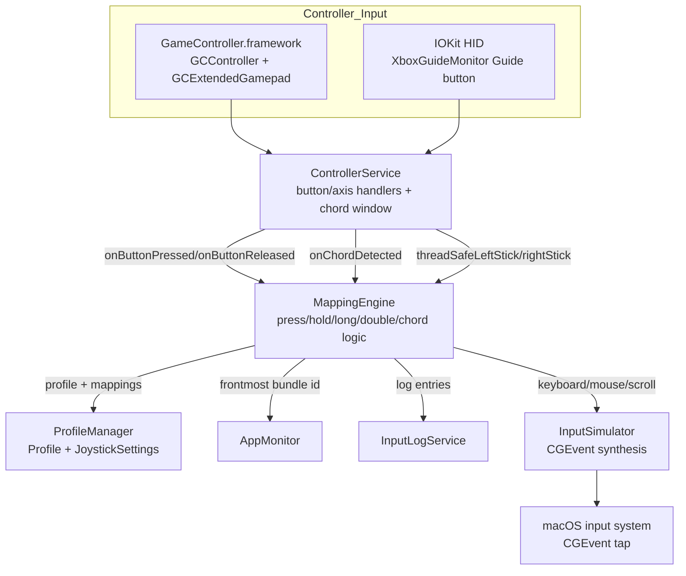

# Input Event Flow

Primary flow for controller inputs through mapping to synthesized macOS events.



<details>
<summary>ASCII fallback</summary>

```text
[GCController/GameController]     [XboxGuideMonitor (IOKit HID)]
              \                       /
               \                     /
              [ControllerService]
                      |
                      | button/chord callbacks + stick state
                      v
                [MappingEngine]
                 /     |      \
   [ProfileManager] [AppMonitor] [InputLogService]
                      |
                      v
                [InputSimulator]
                      |
                      v
                 [macOS CGEvent]
```
</details>

Notes:
- ControllerService performs early chord detection and publishes button callbacks.
- MappingEngine polls joystick state for mouse/scroll, using ProfileManager settings and AppMonitor overrides.
- InputSimulator posts CGEvent input events once Accessibility permissions are granted.
- Detailed pathway diagrams: see `main-input-flows.md`.
