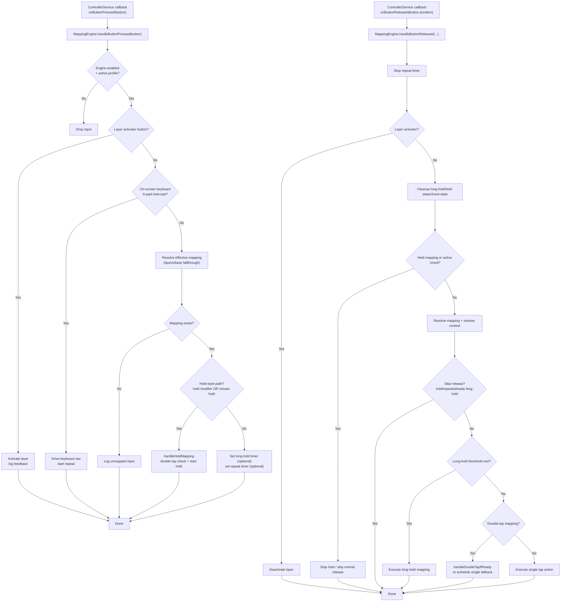
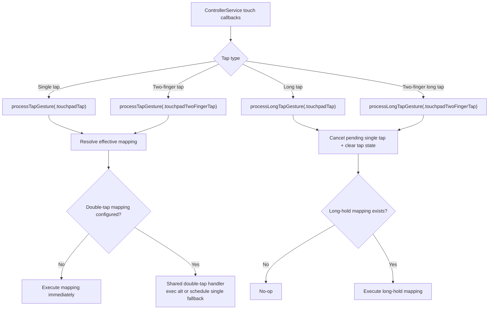
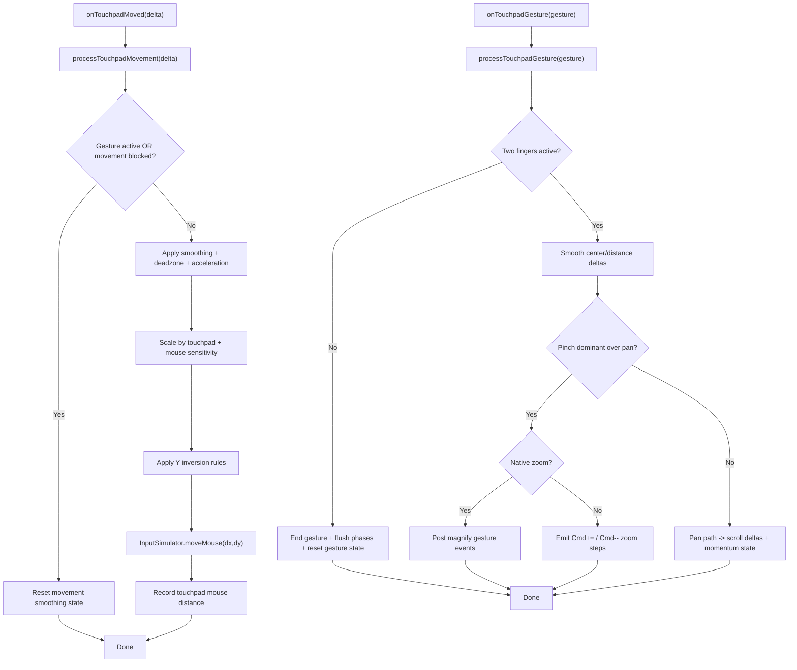
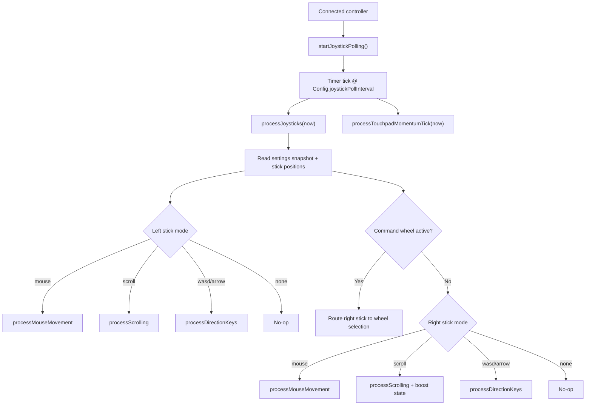

# Main Input Logic Flows

Focused map of the primary runtime pathways:
- Button press/release to keyboard/mouse/system action
- Touchpad tap/long-tap to click/action
- Touchpad movement to mouse movement
- Two-finger touchpad gesture to pan/zoom
- Joystick polling to mouse/scroll/direction keys

## 1) Button Press / Release Pipeline

## 2) Touchpad Tap / Long-Tap Pipeline

## 3) Touchpad Movement vs Two-Finger Gesture

## 4) Joystick Polling Loop (120Hz)

## Notes

- Mapping resolution is centralized through `ButtonMappingResolutionPolicy`.
- Action execution funnels through `MappingExecutor` for key/macro/system-command dispatch.
- Input synthesis is centralized in `InputSimulator` (`pressKey`, `moveMouse`, `scroll`, hold/release modifier paths).
